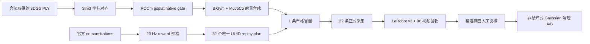

# AMD Radeon 上复现 BiGym + MuJoCo + 3DGS 房间壳

[](https://github.com/eust-w/amd-bigym-3dgs-rocm/actions/workflows/ci.yml)
[](LICENSE)
[](https://rocm.docs.amd.com/)

这是一套经过真实 AMD Radeon `gfx1100` 运行验证的复现仓库：把视觉型 3D Gaussian Splatting 房间壳叠加到 BiGym/MuJoCo 任务画面，在不改变物理碰撞的前提下，完成 `DishwasherUnloadCutleryLong` 32 条独立成功轨迹采集、LeRobot v3 打包、全量视频解码验收和明显异常 Gaussian 的非破坏式清理。

> 技术验收已通过；视觉状态仍为 `awaiting_visual_approval`。房间壳、机器人和工作台完整可见，但源数据的低视角覆盖不足，头部/腕部画面仍可能有柔化和拉伸。本仓库不会把“渲染能跑”包装成“照片级清晰”。


## 已验证结果

| 检查项 | AMD 实测结果 |
| --- | ---: |
| GPU / 架构 | AMD Radeon / `gfx1100` |
| PyTorch / HIP | `2.9.1+gitff65f5b` / `7.2.53211-e1a6bc5663` |
| gsplat native 扩展 | `GATE_OK=True` |
| 任务 | `DishwasherUnloadCutleryLong` |
| 成功 episode | `32/32` |
| 唯一 demo UUID | `32/32` |
| `reward=1.0` | `32/32` |
| 总帧数 | `21,018` |
| H.264 视频 | `96/96` 全部逐帧解码 |
| 严格 3DGS 渲染 | `63,150` 次，无 fallback |
| 3DGS 新增物理对象 | body/geom/collision = `0/0/0` |

机器可读摘要见 [formal32-validation-summary.json](evidence/formal32-validation-summary.json)。

## 方案结构



3DGS 只负责背景颜色；机器人、工作台、洗碗机、抽屉和道具仍由 MuJoCo 渲染并参与物理。合成器使用 MuJoCo segmentation 覆盖动态前景，所以房间壳不会增加碰撞体。

## 快速复现

### 1. 准备 AMD 环境

推荐从 AMD 官方 ROCm/PyTorch 镜像或对应 Radeon wheel 开始。实测环境为 Python 3.12、ROCm 7.2.1、PyTorch 2.9.1。安装方式以 [AMD Radeon PyTorch 官方文档](https://rocm.docs.amd.com/projects/radeon-ryzen/en/latest/docs/install/installrad/native_linux/install-pytorch.html) 为准。

```bash
git clone git@github.com:eust-w/amd-bigym-3dgs-rocm.git
cd amd-bigym-3dgs-rocm
cp .env.example .env
# 编辑 .env 中的本机路径，然后：
set -a
source .env
set +a
make preflight
```

### 2. 安装 BiGym 视觉壳补丁

仓库以 BiGym 官方公开提交 `14beb30318ad14c5d6723175c2ee2281129792af` 为可复现基线。安装脚本拒绝覆盖 dirty checkout，并先执行 patch dry-run。

```bash
make install-bigym
```

补丁包含视觉壳渲染、坐标对齐、物理隔离、三/四相机配置、fail-closed 收据、轨迹搜索、replay 计划和对应测试。上游项目见 [NeuracoreAI/BiGym](https://github.com/NeuracoreAI/bigym)。

### 3. 编译 ROCm 版 gsplat

```bash
make build-gsplat
```

脚本会安装固定的 `gsplat==1.4.0`、应用 [ROCm/gfx1100 补丁](patches/gsplat-1.4.0-rocm-gfx1100.patch)、创建隔离 clang wrapper，并实际渲染一个 64×64 Gaussian 场景。只有输出 `GATE_OK True` 才能继续。

### 4. 放置 3DGS 房间壳

本仓库不包含 DL3DV 原图、视频或派生 PLY。请先阅读 [数据与许可边界](docs/data-license.md)，合法取得或自行重建以下三层：

```text
walls_fixed_kitchen.ply
floor_perimeter.ply
ceiling_lights.ply
```

设置 `SHELL_WALLS`、`SHELL_FLOOR`、`SHELL_CEILING` 后执行：

```bash
make stage-shell
```

该步骤会把 PLY 与本次实测的 [profile](configs/dl3dv-kitchen-cutlery32-profile.json) / [alignment](configs/alignment-appearance-optimized.json) 组织到同一目录并打印 SHA-256，不会修改源 PLY。

### 5. 生成并核验 32 条 replay plan

[replay-plan.example.json](configs/replay-plan.example.json) 只是 schema，不能直接采集。必须在本地已授权的 BiGym official demonstrations 上生成 32 个唯一 UUID，并先做无相机物理回放：

```bash
"$VENV/bin/python" "$BIGYM_DIR/d/replay_generation/replay_plan.py" \
  --compatibility-report /path/to/compatibility-report.json \
  --request DishwasherUnloadCutleryLong=32 \
  --output "$REPLAY_PLAN"

cd "$BIGYM_DIR/d/replay_generation"
"$VENV/bin/python" verify_replay_plan.py \
  --replay-plan "$REPLAY_PLAN" \
  --output /path/to/replay-plan-verification.json
```

`reward=0`、缺失 UUID、版本漂移后失败的轨迹都必须排除。delta 源轨迹会转换为统一的 absolute 训练标签，并验证关节状态等价性。

### 6. 先 1 条冒烟，再采 32 条

把 replay plan 临时裁成 1 条并通过 `reward=1`、三路视频和严格 3DGS 检查后，再执行正式采集：

```bash
make collect
```

采集器按 episode 关闭 Parquet/video writer，进度只在可独立读取的 episode 落盘后推进；中断后不会把未闭合 Parquet 误当成可续跑数据。

### 7. 全量验收与清理

```bash
"$VENV/bin/python" -m pip install -r requirements-validation.txt
make validate
```

验证器检查 32 个 Parquet、32 行 episode metadata、32 个唯一 UUID、32 个成功奖励、21,018 行有限数值、96 个视频的编码/分辨率/fps/帧数/逐帧解码，以及严格渲染次数。

明显异常点采用“生成副本、不覆盖原始 PLY”的方式清理：

```bash
"$VENV/bin/python" scripts/clean_gaussian_ply.py \
  --input "$SHELL_DIR/walls_fixed_kitchen.ply" \
  --output "$SHELL_DIR-cleaned/walls_fixed_kitchen.ply" \
  --manifest "$SHELL_DIR-cleaned/walls.cleaning.json" \
  --bbox-min=-10,-10,-10 \
  --bbox-max=10,10,10 \
  --max-radius 10 \
  --max-world-scale 0.75 \
  --min-alpha 0.001 \
  --selection-note "conservative room envelope; original preserved"
```


实测从 1,000,000 个 Gaussian 中保留 772,721 个；清理版 1 条冒烟仍为 `reward=1.0`，三路原始/清理视频 SSIM 分别为 0.968、0.986、0.982。它减少了明显低 alpha 漂浮雾块，但无法修复源视角未覆盖造成的纹理拉伸。

## 仓库目录

| 路径 | 内容 |
| --- | --- |
| `patches/` | 实测 BiGym 集成补丁、gsplat ROCm/gfx1100 精确补丁 |
| `scripts/` | 环境预检、安装、编译、冒烟、replay、采集、验收、清理 |
| `configs/` | 实测坐标对齐与视觉壳 profile、replay plan schema |
| `evidence/` | 脱敏后的正式 32 条与清理 A/B 机器摘要 |
| `docs/` | 原理、ROCm 适配、采集验收、数据许可和排障 |
| `.github/workflows/` | 公共仓库语法、patch、JSON、secret 和大文件检查 |

## 进一步阅读

- [端到端实现与坐标系](docs/01-end-to-end.md)
- [ROCm / gsplat 适配说明](docs/02-rocm-gsplat.md)
- [32 条采集与失败回放治理](docs/03-collection.md)
- [完整性验收与异常点清理](docs/04-validation-and-cleaning.md)
- [数据与许可边界](docs/data-license.md)
- [常见故障](docs/troubleshooting.md)

## 许可

本仓库代码采用 [Apache-2.0](LICENSE)。第三方代码和数据继续受各自许可约束；`docs/images/` 的研究结果联系表单独按 [图像来源与 CC BY-NC 说明](docs/images/README.md) 管理。DL3DV-10K 需要单独申请访问并接受其 Terms of Use；本仓库不授予任何数据使用或再分发权利。
