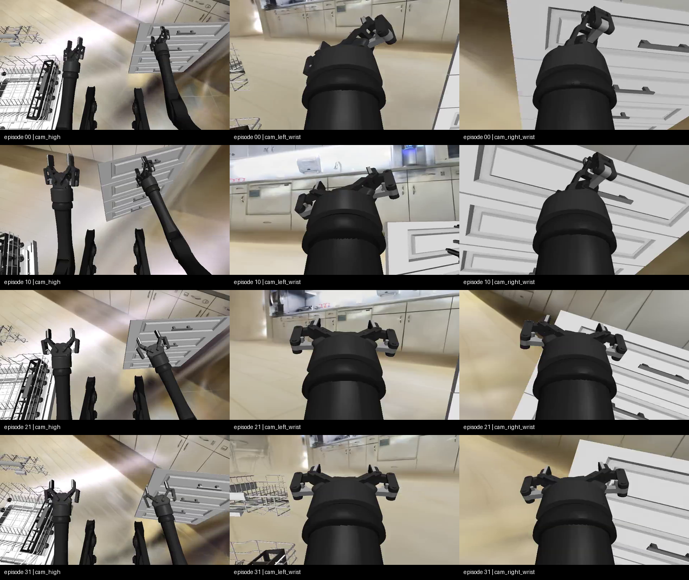
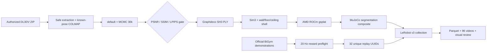
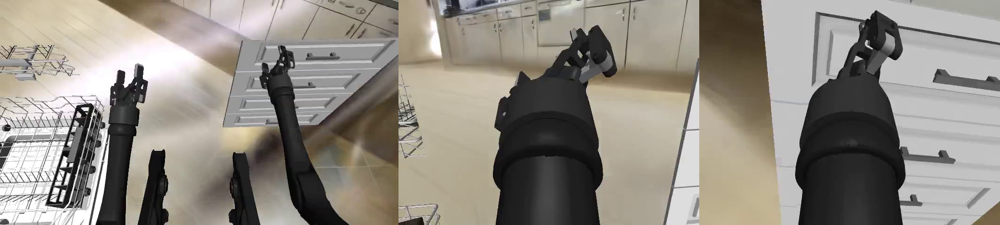
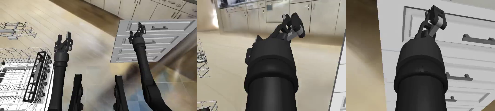

[🇺🇸 English](README.md) | [🇨🇳 中文](README.zh-CN.md)

# End-to-End 3DGS Room Shell for BiGym on AMD ROCm

[](https://github.com/eust-w/amd-bigym-3dgs-rocm/actions/workflows/ci.yml)
[](LICENSE)
[](https://rocm.docs.amd.com/)
[](data/README.md)

An end-to-end open-source project for **authorized images → A800 3DGS
reconstruction → three-layer room shell → AMD ROCm rendering → BiGym/MuJoCo
LeRobot collection**.

The repository contains the real reconstruction, export, alignment, ROCm
adaptation, compositing, replay filtering, collection, validation, and Gaussian
cleanup code used in the experiment. Upstream-restricted images, full PLYs,
official demonstrations, and the 32-episode video dataset are connected through
auditable manifests, SHA-256 contracts, and license-aware acquisition tools
instead of being redistributed.

> Current status: the technical pipeline and curated three-camera visual review
> are complete. The shell, robot, and workbench are visible. A known limitation
> remains: fixed H1 head and wrist cameras extend beyond parts of the source
> capture trajectory, so a few low views can still appear soft or stretched.



## Measured results

| Stage | Verified result |
| --- | --- |
| Source | DL3DV-ALL-960P, 355 `960×540` images, pinned revision and archive hash |
| A800 reconstruction | gsplat MCMC, 30k steps, 1,000,000 Gaussians |
| Held-out metrics | PSNR `35.1623` / SSIM `0.9589` / LPIPS `0.1307` |
| AMD runtime | Radeon `gfx1100`, ROCm/HIP, native gsplat gate passed |
| BiGym task | `DishwasherUnloadCutleryLong` |
| Formal data | `32/32` episodes, `32/32` unique UUIDs, all `reward=1.0` |
| LeRobot v3 | `21,018` frames, `96/96` H.264 videos fully decoded |
| 3DGS | `63,150` strict renders with no fallback |
| Physics isolation | added body / geom / collision = `0 / 0 / 0` |

See the [A800 reconstruction manifest](data/manifests/a800-reconstruction.public.json)
and [formal32 validation summary](evidence/formal32-validation-summary.json).

## Architecture



3DGS supplies the visual background only. The robot, workbench, dishwasher,
drawers, and task props remain MuJoCo-rendered physical entities. Gaussians do
not enter the MJCF physics world.

See the complete [end-to-end architecture](docs/architecture/end-to-end.md).

## 60-second CPU verification

Validate the public package without a GPU or gated data:

```bash
git clone git@github.com:eust-w/amd-bigym-3dgs-rocm.git
cd amd-bigym-3dgs-rocm
python -m pip install 'numpy>=1.26,<3'
make smoke-reconstruction
make verify
```

CI generates an Apache-2.0 synthetic Gaussian room and executes binary PLY
parsing, Sim(3), wall/floor/ceiling splitting, hash recording, central-workspace
exclusion, and zero-physics-object validation. This proves the code contract,
not GPU availability or photographic quality.

## Full reproduction

### 1. Acquire and verify the source

Accept the current DL3DV terms independently, then use your local Hugging Face
login. The downloader never accepts a token on the command line.

Exact reproducible source:

- access page: [DL3DV/DL3DV-ALL-960P](https://huggingface.co/datasets/DL3DV/DL3DV-ALL-960P);
- pinned scene object: [`3K/951f9d...zip`](https://huggingface.co/datasets/DL3DV/DL3DV-ALL-960P/blob/abb4dab0d4b6d93c32e6d901c06c35bad03210fb/3K/951f9db189a7023708b7798e147e04048a84ce039c5761e8ecb1aa65dcb2da86.zip);
- revision: `abb4dab0d4b6d93c32e6d901c06c35bad03210fb`;
- archive SHA-256: `4a6f3eac1ff4d2545b655fdfe5c6edd7e08f92e847584fabf933a09e592be563`.

```bash
python -m pip install -r reconstruction/requirements-core.txt
hf auth login
make download-reference-data
```

The gate checks revision, byte count, SHA-256, ZIP CRC, image count, and camera
poses. Private data is written under the Git-ignored `data/private/` tree.

### 2. Reconstruct the room shell on A800

```bash
git clone https://github.com/nerfstudio-project/gsplat.git /workspace/gsplat
git -C /workspace/gsplat checkout 4d3a3b69db4de0326f983ccf7b7b255271a17b01

cp .env.example .env
set -a; source .env; set +a
make install-bigym

export SOURCE_ARCHIVE="$PWD/data/private/dl3dv-kitchen/951f9db189a7023708b7798e147e04048a84ce039c5761e8ecb1aa65dcb2da86.zip"
export SOURCE_REPORT="$PWD/data/private/dl3dv-kitchen/source.json"
export GSPLAT_DIR=/workspace/gsplat
export BIGYM_DIR=/workspace/amd-bigym-3dgs/src/bigym
export WORK_ROOT=/workspace/runs/dl3dv-kitchen-a800
make reconstruct
```

The entrypoint performs:

1. safe extraction and official-pose-to-COLMAP conversion;
2. known-pose SIFT matching and sparse initialization;
3. `default` and `mcmc` 30k candidates;
4. fail-closed selection requiring PSNR ≥ 30, SSIM ≥ 0.92, LPIPS ≤ 0.15;
5. Graphdeco SH3 PLY, camera path, MuJoCo OBB, Sim(3), and room-layer export;
6. optional 300-frame BiGym three-camera acceptance.

See the [reconstruction guide](reconstruction/README.md).

### 3. Run the shell on AMD Radeon

Start from an AMD-supported ROCm/PyTorch environment:

```bash
make preflight
make build-gsplat

export SHELL_WALLS=/path/to/walls_fixed_kitchen.ply
export SHELL_FLOOR=/path/to/floor_perimeter.ply
export SHELL_CEILING=/path/to/ceiling_lights.ply
make stage-shell
```

`build-gsplat` pins `gsplat==1.4.0`, applies the measured ROCm/gfx1100 patch,
and renders an actual 64×64 Gaussian scene. Continue only after `GATE_OK True`.

### 4. Collect 32 Cutlery episodes

Build a 32-UUID replay plan from locally authorized official demonstrations and
run camera-free physics preflight first. Exclude `reward=0`, missing UUIDs, and
replays that fail after simulator-version drift.

```bash
make collect
make validate
```

The collector commits one episode at a time. Validation checks Parquet files,
episode metadata, rewards, finite state/action tensors, codec/FPS/frame counts,
full video decoding, strict render counts, and SHA256SUMS.

## Data boundary

| Content | Public Git | Authorized local storage |
| --- | :---: | :---: |
| Source identity, revision, size, hash, license | ✅ | ✅ |
| Synthetic Gaussian CI fixture | generator ✅ | ✅ |
| DL3DV source ZIP/images | ❌ | `data/private/` |
| Complete derived PLY/checkpoint | ❌ | user-controlled artifact store |
| Official demonstrations/real UUIDs | ❌ | user-controlled demo store |
| Full 32-episode LeRobot videos | ❌ | user-controlled dataset root |
| Sanitized metrics, contact sheet, cleanup A/B | ✅ | ✅ |

This separation is intentional: processing code and data contracts are public,
while every user obtains restricted inputs under the upstream terms. See the
[data plane](data/README.md) and [license boundary](docs/data-license.md).

## Repository layout

```text
.
├── reconstruction/        # acquisition, COLMAP, training, PLY and shell export
│   ├── bin/               # portable acquisition and reconstruction commands
│   ├── src/               # measured Python implementation
│   ├── config/            # version and quality pins
│   └── reference/         # exact A800 provenance runner
├── data/
│   ├── manifests/         # source, reconstruction, and Cutlery32 contracts
│   └── samples/           # synthetic smoke documentation
├── patches/               # BiGym shell and gsplat ROCm patches
├── scripts/               # AMD runtime, collection, validation, cleanup, release
├── configs/               # measured Sim(3), visual profile, replay schema
├── evidence/              # sanitized machine-readable evidence
├── docs/                  # architecture, ROCm, collection, licensing, debugging
└── .github/workflows/     # leak, syntax, patch, and reconstruction CI
```

## Gaussian cleanup

Cleanup always writes a new asset and preserves the authoritative PLY:

```bash
python scripts/clean_gaussian_ply.py \
  --input "$SHELL_DIR/walls_fixed_kitchen.ply" \
  --output "$SHELL_DIR-cleaned/walls_fixed_kitchen.ply" \
  --manifest "$SHELL_DIR-cleaned/walls.cleaning.json" \
  --bbox-min=-10,-10,-10 --bbox-max=10,10,10 \
  --max-radius 10 --max-world-scale 0.75 --min-alpha 0.001
```




The measured cleanup retained 772,721 of 1,000,000 Gaussians. It reduced
low-alpha floating haze but cannot repair stretching caused by missing source
view coverage.

## Documentation

- [Reconstruction pipeline](reconstruction/README.md)
- [End-to-end architecture](docs/architecture/end-to-end.md)
- [Coordinates and physics isolation](docs/01-end-to-end.md)
- [ROCm / gsplat adaptation](docs/02-rocm-gsplat.md)
- [32-episode collection and replay reliability](docs/03-collection.md)
- [Integrity validation and Gaussian cleanup](docs/04-validation-and-cleaning.md)
- [Data and licensing boundary](docs/data-license.md)
- [Troubleshooting](docs/troubleshooting.md)

## License and citation

Original repository code is licensed under [Apache-2.0](LICENSE). Third-party
code and data remain under their respective terms; see [NOTICE](NOTICE) and
[CITATION.cff](CITATION.cff). This repository grants no redistribution rights
for DL3DV data, derived PLYs, BiGym demonstrations, or collected videos.
