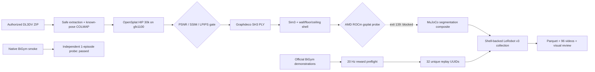

[🇺🇸 English](README.md) | [🇨🇳 中文](README.zh-CN.md)

# End-to-End 3DGS Room Shell for BiGym on AMD ROCm

[](https://github.com/eust-w/amd-bigym-3dgs-rocm/actions/workflows/ci.yml)
[](LICENSE)
[](https://rocm.docs.amd.com/)
[](https://huggingface.co/datasets/eustance/amd-bigym-3dgs-kitchen-shell)

An end-to-end open-source project for **authorized images → AMD gfx1100/HIP
3DGS reconstruction → three-layer room shell → AMD ROCm rendering →
BiGym/MuJoCo LeRobot collection**. The historical A800 result remains as a
reference manifest; the AMD-native branch does not depend on an NVIDIA GPU.

The repository contains the real reconstruction, export, alignment, ROCm
adaptation, compositing, replay filtering, collection, validation, and Gaussian
cleanup code used in the experiment. The curated derived PLY shell is published
as a separately gated Hugging Face dataset. Upstream images, official
demonstrations, and the 32-episode video dataset remain outside this repository
and are connected through auditable manifests, SHA-256 contracts, and
license-aware acquisition tools.

> Verified on 2026-08-04: the AMD-native OpenSplat HIP 30k reconstruction,
> conservative manual cleanup, task-aware shell export, and native source-camera
> shell renders passed on a Radeon PRO W7900D (`gfx1100`). Native BiGym and one
> independent 683-frame CutleryLong episode also passed. **Live 3DGS compositing
> inside BiGym is still blocked**: the strict gsplat-backed probe exits `139`.
> Therefore no gfx1100 shell-backed collection is claimed complete. See the
> [measured execution report](docs/06-gfx1100-execution-report.md).


## Measured results

| Stage | Verified result |
| --- | --- |
| Source | DL3DV-ALL-960P, 355 `960×540` images, pinned revision and archive hash |
| A800 reconstruction | gsplat MCMC, 30k steps, 1,000,000 Gaussians |
| Held-out metrics | PSNR `35.1623` / SSIM `0.9589` / LPIPS `0.1307` |
| AMD-native reconstruction | OpenSplat HIP, 30k, 1,198,821 Gaussians, PSNR `33.8326` / SSIM `0.971857` / LPIPS `0.038427` |
| Manual visual-safe cleanup | 177 spatial outliers removed; 1,198,644 Gaussians; scale rule rejected after A/B review |
| CutleryLong shell | 991,213 Gaussians; zero central-workspace violations; native OpenSplat views passed |
| Native BiGym on AMD | 32-frame, three-camera smoke passed |
| Live 3DGS in BiGym | **Blocked**: strict gsplat-backed probe exits `139`; formal shell acceptance not passed |
| BiGym task | `DishwasherUnloadCutleryLong` |
| Independent AMD smoke data | 1 native-only episode, 683 frames, receipt `reward=1.0`; not shell-backed |
| Historical formal data | `32/32` episodes, `32/32` unique UUIDs, all `reward=1.0`; A800-parity archive preserved |
| LeRobot v3 | `21,018` frames, `96/96` H.264 videos fully decoded |
| Historical A800 3DGS | `63,150` strict renders with no fallback |
| Physics isolation | added body / geom / collision = `0 / 0 / 0` |
| Published shell | 4 PLYs, gated Hugging Face release, remote SHA-256 verified |

See the [gfx1100 execution evidence](evidence/gfx1100-20260804-summary.json),
[A800 reconstruction manifest](data/manifests/a800-reconstruction.public.json),
and [formal32 validation summary](evidence/formal32-validation-summary.json).

## Download the published 3DGS shell

The combined one-million-Gaussian shell, three independently loadable layers,
alignment, camera path, manifests, and preview images are available from the
[gated Hugging Face release](https://huggingface.co/datasets/eustance/amd-bigym-3dgs-kitchen-shell).
Request access on the dataset page and authenticate locally before downloading:

```bash
hf auth login
hf download eustance/amd-bigym-3dgs-kitchen-shell \
  --repo-type dataset \
  --include 'ply/*' 'metadata/*' 'SHA256SUMS' \
  --local-dir ./data/private/amd-bigym-3dgs-kitchen-shell
cd ./data/private/amd-bigym-3dgs-kitchen-shell
shasum -a 256 -c SHA256SUMS
```

The release is non-commercial and remains subject to its dataset card, the
current DL3DV terms, and independent access approval for the upstream source.

## Architecture



3DGS supplies the visual background only. The robot, workbench, dishwasher,
drawers, and task props remain MuJoCo-rendered physical entities. Gaussians do
not enter the MJCF physics world.

See the complete [end-to-end architecture](docs/architecture/end-to-end.md).

## 60-second CPU verification

Validate the public package without a GPU or gated data:

```bash
git clone git@github.com:eust-w/amd-bigym-3dgs-rocm.git
cd amd-bigym-3dgs-rocm
python -m pip install 'numpy>=1.26,<3'
make smoke-reconstruction
make verify
```

CI generates an Apache-2.0 synthetic Gaussian room and executes binary PLY
parsing, Sim(3), wall/floor/ceiling splitting, hash recording, central-workspace
exclusion, and zero-physics-object validation. This proves the code contract,
not GPU availability or photographic quality.

## Full reproduction

### 1. Acquire and verify the source

Accept the current DL3DV terms independently, then use your local Hugging Face
login. The downloader never accepts a token on the command line.

Exact reproducible source:

- access page: [DL3DV/DL3DV-ALL-960P](https://huggingface.co/datasets/DL3DV/DL3DV-ALL-960P);
- pinned scene object: [`3K/951f9d...zip`](https://huggingface.co/datasets/DL3DV/DL3DV-ALL-960P/blob/abb4dab0d4b6d93c32e6d901c06c35bad03210fb/3K/951f9db189a7023708b7798e147e04048a84ce039c5761e8ecb1aa65dcb2da86.zip);
- revision: `abb4dab0d4b6d93c32e6d901c06c35bad03210fb`;
- archive SHA-256: `4a6f3eac1ff4d2545b655fdfe5c6edd7e08f92e847584fabf933a09e592be563`.

```bash
python -m pip install -r reconstruction/requirements-core.txt
hf auth login
make download-reference-data
```

The gate checks revision, byte count, SHA-256, ZIP CRC, image count, and camera
poses. Private data is written under the Git-ignored `data/private/` tree.

### 2. Reconstruct natively on AMD gfx1100

Prepare the pinned OpenSplat checkout and a TheRock/ROCm Python environment,
then build the real HIP backend:

```bash
git clone https://github.com/pierotofy/OpenSplat.git /root/OpenSplat
git -C /root/OpenSplat checkout 9fb62fde8b7b8c416121d3cbdcda278ffd9682f7

export ROCM_VENV=/root/opensplat-env
make build-opensplat-rocm

export DATASET_DIR=/workspace/persistent/rocm3dgs-inputs/dl3dv-kitchen
export RUN_ROOT=/workspace/persistent/rocm3dgs-results
export RUN_ID=kitchen-gfx1100-30k
make launch-rocm-30k
```

The runner rejects non-`gfx1100` hardware, incomplete COLMAP input, a wrong
OpenSplat revision, and reused output directories. It records the GPU, HIP
version, step count, process state, and final PLY SHA-256. Completion does not
bypass held-out metrics, PLY health, coordinate alignment, or visual review.
See the [AMD-native reconstruction guide](docs/05-amd-native-reconstruction.md).

### 2b. Historical A800 reference path

The previous A800/gsplat path is retained to reproduce the published reference
manifest and compare backends:

```bash
git clone https://github.com/nerfstudio-project/gsplat.git /workspace/gsplat
git -C /workspace/gsplat checkout 4d3a3b69db4de0326f983ccf7b7b255271a17b01

cp .env.example .env
set -a; source .env; set +a
make install-bigym

export SOURCE_ARCHIVE="$PWD/data/private/dl3dv-kitchen/951f9db189a7023708b7798e147e04048a84ce039c5761e8ecb1aa65dcb2da86.zip"
export SOURCE_REPORT="$PWD/data/private/dl3dv-kitchen/source.json"
export GSPLAT_DIR=/workspace/gsplat
export BIGYM_DIR=/workspace/amd-bigym-3dgs/src/bigym
export WORK_ROOT=/workspace/runs/dl3dv-kitchen-a800
make reconstruct
```

The entrypoint performs:

1. safe extraction and official-pose-to-COLMAP conversion;
2. known-pose SIFT matching and sparse initialization;
3. `default` and `mcmc` 30k candidates;
4. fail-closed selection requiring PSNR ≥ 30, SSIM ≥ 0.92, LPIPS ≤ 0.15;
5. Graphdeco SH3 PLY, camera path, MuJoCo OBB, Sim(3), and room-layer export;
6. optional 300-frame BiGym three-camera acceptance.

See the [reconstruction guide](reconstruction/README.md).

### 3. Run the shell in BiGym on AMD Radeon

Start from an AMD-supported ROCm/PyTorch environment:

```bash
make preflight
make build-gsplat

export SHELL_WALLS=/path/to/walls_fixed_kitchen.ply
export SHELL_FLOOR=/path/to/floor_perimeter.ply
export SHELL_CEILING=/path/to/ceiling_lights.ply
make stage-shell
```

`build-gsplat` pins `gsplat==1.4.0` and applies the measured ROCm/gfx1100 patch.
`scripts/rocm_gsplat_sitecustomize.py` can opt in to an already-built extension
without modifying site-packages. Importing that extension is not sufficient:
the current strict BiGym shell probe reaches the rendering path and exits `139`.
Do not start a shell-backed formal collection until the probe renders all three
cameras with no fallback. See [ROCm / gsplat adaptation](docs/02-rocm-gsplat.md).

### 4. Collect Cutlery episodes after the live-shell gate

Build a 32-UUID replay plan from locally authorized official demonstrations and
run camera-free physics preflight first. Exclude `reward=0`, missing UUIDs, and
replays that fail after simulator-version drift.

```bash
make collect
make validate
```

The 2026-08-04 Radeon run collected one isolated **native-only** 683-frame
episode with receipt `reward=1.0`; it did not overwrite the retained 32-episode
A800-parity archive and is not evidence of live-3DGS collection. The collector
commits one episode at a time. Validation checks Parquet files,
episode metadata, rewards, finite state/action tensors, codec/FPS/frame counts,
full video decoding, strict render counts, and SHA256SUMS.

## Data boundary

| Content | Public Git | Gated Hugging Face | Authorized local storage |
| --- | :---: | :---: | :---: |
| Source identity, revision, size, hash, license | ✅ | ✅ | ✅ |
| Synthetic Gaussian CI fixture | generator ✅ | — | ✅ |
| DL3DV source ZIP/images | ❌ | ❌ | `data/private/` |
| Curated derived PLY shell | manifest only | ✅ | optional cache |
| Training checkpoint | ❌ | ❌ | user-controlled artifact store |
| Official demonstrations/real UUIDs | ❌ | ❌ | user-controlled demo store |
| Full 32-episode LeRobot videos | ❌ | ❌ | user-controlled dataset root |
| Sanitized metrics, contact sheet, cleanup A/B | ✅ | previews ✅ | ✅ |

This separation is intentional: code stays lightweight in Git, the curated PLY
release has its own gated license boundary, and every user obtains restricted
upstream inputs independently. See the [data plane](data/README.md) and
[license boundary](docs/data-license.md).

## Repository layout

```text
.
├── reconstruction/        # acquisition, COLMAP, training, PLY and shell export
│   ├── bin/               # portable acquisition and reconstruction commands
│   ├── src/               # measured Python implementation
│   ├── config/            # version and quality pins
│   └── reference/         # exact A800 provenance runner
├── data/
│   ├── manifests/         # source, reconstruction, and Cutlery32 contracts
│   └── samples/           # synthetic smoke documentation
├── patches/               # BiGym, gsplat ROCm, and OpenSplat HIP patches
├── scripts/               # AMD runtime, collection, validation, cleanup, release
├── configs/               # measured Sim(3), visual profile, replay schema
├── evidence/              # sanitized machine-readable evidence
├── docs/                  # architecture, ROCm, collection, licensing, debugging
└── .github/workflows/     # leak, syntax, patch, and reconstruction CI
```

## Historical A800 Gaussian cleanup

Cleanup always writes a new asset and preserves the authoritative PLY:

```bash
python scripts/clean_gaussian_ply.py \
  --input "$SHELL_DIR/walls_fixed_kitchen.ply" \
  --output "$SHELL_DIR-cleaned/walls_fixed_kitchen.ply" \
  --manifest "$SHELL_DIR-cleaned/walls.cleaning.json" \
  --bbox-min=-10,-10,-10 --bbox-max=10,10,10 \
  --max-radius 10 --max-world-scale 0.75 --min-alpha 0.001
```


The historical A800 cleanup retained 772,721 of 1,000,000 Gaussians. It reduced
low-alpha floating haze but cannot repair stretching caused by missing source
view coverage. The accepted gfx1100 cleanup is intentionally more conservative:
it removes 177 spatial outliers and is documented in the
[2026-08-04 execution report](docs/06-gfx1100-execution-report.md).

## Documentation

- [Reconstruction pipeline](reconstruction/README.md)
- [End-to-end architecture](docs/architecture/end-to-end.md)
- [Coordinates and physics isolation](docs/01-end-to-end.md)
- [ROCm / gsplat adaptation](docs/02-rocm-gsplat.md)
- [AMD gfx1100 native reconstruction](docs/05-amd-native-reconstruction.md)
- [AMD gfx1100 measured execution report](docs/06-gfx1100-execution-report.md)
- [32-episode collection and replay reliability](docs/03-collection.md)
- [Integrity validation and Gaussian cleanup](docs/04-validation-and-cleaning.md)
- [Data and licensing boundary](docs/data-license.md)
- [Troubleshooting](docs/troubleshooting.md)

## License and citation

Original repository code is licensed under [Apache-2.0](LICENSE). Third-party
code and data remain under their respective terms; see [NOTICE](NOTICE) and
[CITATION.cff](CITATION.cff). This repository grants no redistribution rights
for DL3DV data, BiGym demonstrations, or collected videos. The separate derived
PLY release is governed by its own dataset card, CC BY-NC 4.0 notice, and the
current DL3DV terms.
