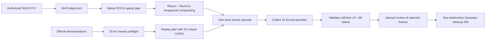

[🇺🇸 English](README.md) | [🇨🇳 中文](README.zh-CN.md)

# Reproducing a BiGym + MuJoCo + 3DGS Room Shell on AMD Radeon

[](https://github.com/eust-w/amd-bigym-3dgs-rocm/actions/workflows/ci.yml)
[](LICENSE)
[](https://rocm.docs.amd.com/)

This repository provides a reproduction pipeline validated on a real AMD Radeon `gfx1100` GPU. It composites a visual 3D Gaussian Splatting room shell into BiGym/MuJoCo task views without changing physical collisions. The validated workflow includes 32 independent successful `DishwasherUnloadCutleryLong` trajectories, LeRobot v3 packaging, full video decoding checks, and non-destructive cleanup of visibly incorrect Gaussians. The room shell, robot, and workbench are fully visible across all three task cameras.


## Validated Results

| Check | Measured AMD result |
| --- | ---: |
| GPU / architecture | AMD Radeon / `gfx1100` |
| PyTorch / HIP | `2.9.1+gitff65f5b` / `7.2.53211-e1a6bc5663` |
| Native gsplat extension | `GATE_OK=True` |
| Task | `DishwasherUnloadCutleryLong` |
| Successful episodes | `32/32` |
| Unique demo UUIDs | `32/32` |
| `reward=1.0` | `32/32` |
| Total frames | `21,018` |
| H.264 videos | `96/96` fully decoded frame by frame |
| Strict 3DGS renders | `63,150` with no fallback |
| Physics objects added by 3DGS | body/geom/collision = `0/0/0` |

See [formal32-validation-summary.json](evidence/formal32-validation-summary.json) for the machine-readable summary.

## Pipeline



3DGS supplies background color only. The robot, workbench, dishwasher, drawers, and task objects remain MuJoCo-rendered physical entities. The compositor uses MuJoCo segmentation to preserve dynamic foregrounds, so the room shell introduces no collision geometry.

## Quick Reproduction

### 1. Prepare the AMD environment

Start with an official AMD ROCm/PyTorch image or the corresponding Radeon wheels. The validated environment used Python 3.12, ROCm 7.2.1, and PyTorch 2.9.1. Follow the [official AMD Radeon PyTorch installation guide](https://rocm.docs.amd.com/projects/radeon-ryzen/en/latest/docs/install/installrad/native_linux/install-pytorch.html).

```bash
git clone git@github.com:eust-w/amd-bigym-3dgs-rocm.git
cd amd-bigym-3dgs-rocm
cp .env.example .env
# Edit the local paths in .env, then run:
set -a
source .env
set +a
make preflight
```

### 2. Install the BiGym visual-shell patch

The reproducible baseline is the official BiGym commit `14beb30318ad14c5d6723175c2ee2281129792af`. The installer refuses to overwrite a dirty checkout and performs a patch dry-run before applying any changes.

```bash
make install-bigym
```

The patch includes visual-shell rendering, coordinate alignment, physics isolation, three- and four-camera configurations, fail-closed receipts, trajectory search, replay planning, and corresponding tests. See the upstream [NeuracoreAI/BiGym](https://github.com/NeuracoreAI/bigym) project.

### 3. Build gsplat for ROCm

```bash
make build-gsplat
```

The script installs the pinned `gsplat==1.4.0` release, applies the [ROCm/gfx1100 patch](patches/gsplat-1.4.0-rocm-gfx1100.patch), creates an isolated Clang wrapper, and renders an actual 64×64 Gaussian scene. Continue only when it prints `GATE_OK True`.

### 4. Stage the 3DGS room shell

This repository does not include DL3DV source images, videos, or derived PLY files. Read the [data and licensing boundaries](docs/data-license.md), then legally obtain or reconstruct the following three layers:

```text
walls_fixed_kitchen.ply
floor_perimeter.ply
ceiling_lights.ply
```

Set `SHELL_WALLS`, `SHELL_FLOOR`, and `SHELL_CEILING`, then run:

```bash
make stage-shell
```

This stages the PLY files together with the validated [profile](configs/dl3dv-kitchen-cutlery32-profile.json) and [alignment](configs/alignment-appearance-optimized.json), then prints SHA-256 checksums. It never modifies the source PLY files.

### 5. Generate and verify a 32-trajectory replay plan

[replay-plan.example.json](configs/replay-plan.example.json) is a schema example and cannot be used directly for collection. Generate 32 unique UUIDs from locally authorized official BiGym demonstrations, then run camera-free physics replay validation:

```bash
"$VENV/bin/python" "$BIGYM_DIR/d/replay_generation/replay_plan.py" \
  --compatibility-report /path/to/compatibility-report.json \
  --request DishwasherUnloadCutleryLong=32 \
  --output "$REPLAY_PLAN"

cd "$BIGYM_DIR/d/replay_generation"
"$VENV/bin/python" verify_replay_plan.py \
  --replay-plan "$REPLAY_PLAN" \
  --output /path/to/replay-plan-verification.json
```

Exclude `reward=0` trajectories, missing UUIDs, and trajectories that fail after version drift. Delta-source trajectories are converted into consistent absolute training labels, with joint-state equivalence checks.

### 6. Run one smoke episode, then collect 32

Temporarily trim the replay plan to one trajectory. After it passes `reward=1`, three-camera video checks, and strict 3DGS validation, start the formal collection:

```bash
make collect
```

The collector closes Parquet and video writers at each episode boundary. Progress advances only after an episode is independently readable, preventing interrupted Parquet files from being treated as resumable data.

### 7. Validate the complete collection and clean Gaussians

```bash
"$VENV/bin/python" -m pip install -r requirements-validation.txt
make validate
```

The validator checks 32 Parquet files, 32 episode metadata rows, 32 unique UUIDs, 32 successful rewards, 21,018 finite numeric rows, and all 96 videos for codec, resolution, FPS, frame counts, and full frame-by-frame decoding. It also verifies the exact strict-render count.

Visibly incorrect points are cleaned into a new copy so the original PLY is preserved:

```bash
"$VENV/bin/python" scripts/clean_gaussian_ply.py \
  --input "$SHELL_DIR/walls_fixed_kitchen.ply" \
  --output "$SHELL_DIR-cleaned/walls_fixed_kitchen.ply" \
  --manifest "$SHELL_DIR-cleaned/walls.cleaning.json" \
  --bbox-min=-10,-10,-10 \
  --bbox-max=10,10,10 \
  --max-radius 10 \
  --max-world-scale 0.75 \
  --min-alpha 0.001 \
  --selection-note "conservative room envelope; original preserved"
```


The validated cleanup retained 772,721 of 1,000,000 Gaussians. A complete smoke episode on the cleaned shell still achieved `reward=1.0`. SSIM between original and cleaned video streams was 0.968, 0.986, and 0.982 across the three cameras, while visibly reducing low-alpha floating haze.

## Repository Layout

| Path | Contents |
| --- | --- |
| `patches/` | Validated BiGym integration patch and precise gsplat ROCm/gfx1100 patch |
| `scripts/` | Environment preflight, installation, build, smoke, replay, collection, validation, and cleanup tools |
| `configs/` | Validated coordinate alignment, visual-shell profile, and replay-plan schema |
| `evidence/` | Sanitized machine-readable summaries for the formal 32-episode collection and cleanup A/B |
| `docs/` | Architecture, ROCm adaptation, collection validation, data licensing, and troubleshooting |
| `.github/workflows/` | Public-repository syntax, patch, JSON, secret, and large-file checks |

## Further Reading

- [End-to-end implementation and coordinate systems](docs/01-end-to-end.md)
- [ROCm / gsplat adaptation](docs/02-rocm-gsplat.md)
- [32-episode collection and replay reliability](docs/03-collection.md)
- [Integrity validation and Gaussian cleanup](docs/04-validation-and-cleaning.md)
- [Data and licensing boundaries](docs/data-license.md)
- [Troubleshooting](docs/troubleshooting.md)

## License

Repository code is licensed under [Apache-2.0](LICENSE). Third-party code and data remain subject to their respective licenses. Research-result contact sheets under `docs/images/` are governed separately by the [image provenance and CC BY-NC notice](docs/images/README.md). DL3DV-10K requires separate access approval and acceptance of its Terms of Use; this repository grants no data-use or redistribution rights.
