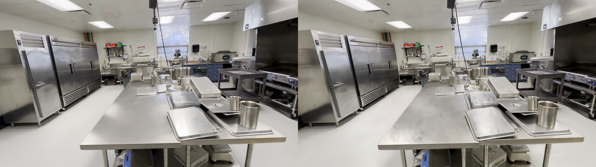
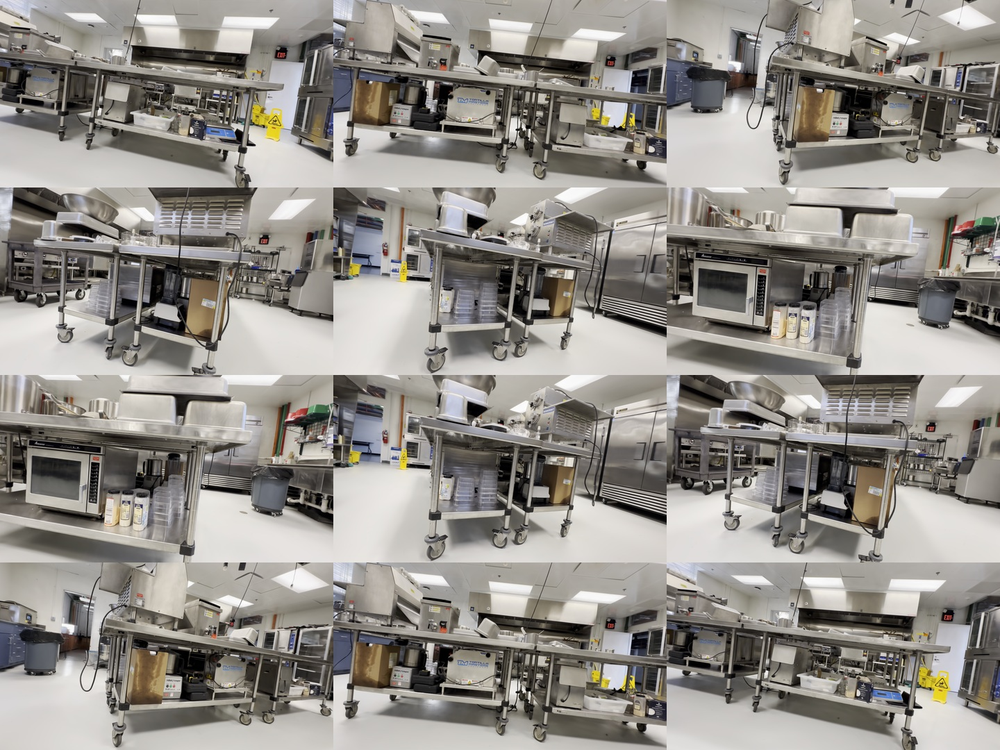

<div align="center">
  <h1>AMD Radeon BiGym + 3DGS Kitchen</h1>
  <p><strong>DL3DV reconstruction to provider-neutral BiGym evaluation on AMD ROCm</strong></p>
  <p>
    <a href="https://github.com/eust-w/amd-bigym-3dgs-rocm/actions/workflows/ci.yml"></a>
    <a href="evidence/amd-rocm-main-status.json"></a>
    <a href="evidence/amd-rocm-main-status.json"></a>
    <a href="reconstruction/README.md"></a>
    <a href="patches/bigym-3dgs-shell-and-collector.patch"></a>
    <a href="#amdrocm-quick-start"></a>
    <a href="LICENSE"></a>
    <a href="https://huggingface.co/datasets/eustance/amd-bigym-3dgs-kitchen-shell/tree/amd-rocm-w7900d-20260804"></a>
  </p>
  <p>
    <a href="#bigym--3dgs-runtime-demo">Demo</a> ·
    <a href="#reproduced-on-amd-radeon">AMD result</a> ·
    <a href="#amdrocm-quick-start">Quick start</a> ·
    <a href="#repository-checks">Validation</a> ·
    <a href="https://github.com/eust-w/amd-bigym-3dgs-rocm/tree/main">AMD/ROCm main</a>
  </p>
  <p><a href="README.md">English</a> · <a href="README.zh-CN.md">简体中文</a></p>
</div>

This is the end-to-end AMD Radeon/ROCm implementation for reconstructing a
DL3DV kitchen, loading its 3D Gaussian room shell in BiGym, evaluating an
external policy, recording all three cameras and validating complete
trajectories. The reconstruction and downloadable shell named below were
produced on AMD Radeon PRO W7900D.

## BiGym + 3DGS runtime demo

[](docs/videos/bigym-3dgs-shell-reference.mp4)

The six-second preview plays directly in GitHub. Click it to watch the full
[31-second, `1696x960` MP4](docs/videos/bigym-3dgs-shell-reference.mp4), with
head, left-wrist, right-wrist and external views. This is a runtime integration
reference, not evidence that the separate 32-episode collection has passed AMD
replay acceptance.

## Reproduced on AMD Radeon



The left half is the held-out `1920x1080` source frame and the right half is
the render produced on an AMD Radeon PRO W7900D after 15,000 OpenSplat/HIP
steps. The clear-preview gate passed at PSNR `27.9066` and SSIM `0.9370`.
Obvious projected streak Gaussians and one all-camera-invisible spatial outlier
were removed before the room-shell export.

| AMD result | Verified value |
| --- | --- |
| GPU | AMD Radeon PRO W7900D, `gfx1100` |
| Runtime | PyTorch ROCm/HIP |
| Reconstruction | 352 images at `1920x1080`, 15,000 OpenSplat steps |
| Cleaned output | 1,458,354 Gaussians |
| Room shell | central `3x3m` workspace clear; zero added physics/collisions |
| Machine status | `amd_rocm_reproduction_passed` |

## Source material



The source contact sheet is provided for provenance. The downloadable PLY and
BiGym shell configuration in this README always use the AMD Hugging Face
revision shown below.

## AMD evidence boundary

| Artifact | Current claim |
| --- | --- | --- |
| GitHub `main` | AMD reconstruction code, receipt and reproducible checks |
| HF revision `amd-rocm-w7900d-20260804` | AMD cleaned PLY, split/combined shell, alignment, profile and preview |
| BiGym collection | not promoted by the reconstruction receipt; three-camera collection remains a separate acceptance stage |

The reconstruction has been reproduced on Radeon. This does **not** claim that
the separate 32-episode collection has also been replayed on AMD: downstream
acceptance still requires native gsplat rasterization, strict three-camera
replay, full-video decode and separate human visual review.

Machine-readable AMD status is recorded in
[`evidence/amd-rocm-main-status.json`](evidence/amd-rocm-main-status.json).

## Canonical inputs

| Artifact | Canonical value |
| --- | --- |
| AMD 3DGS shell | [HF revision `amd-rocm-w7900d-20260804`](https://huggingface.co/datasets/eustance/amd-bigym-3dgs-kitchen-shell/tree/amd-rocm-w7900d-20260804) |
| DL3DV source | [DL3DV/DL3DV-ALL-2K](https://huggingface.co/datasets/DL3DV/DL3DV-ALL-2K), revision `e035bc5efd8dc5b2fa1e704cb2b1086fd9ec2c5c` |
| Scene hash | `90e70328f9196bc78c7e6c695c1e8cbb55a3c961cccf34c566966a5e2d8d8947` |
| AMD cleaned reconstruction | 1,458,354 Gaussians, SHA-256 `d49bcf7219f63a92ee0d40f8d86e618176892ec89853fecc5e217829bff42b9b` |
| AMD combined shell | 1,458,255 Gaussians, SHA-256 `67ab42e99833749d17db499f4ea1c968b193db26760f567244632f41ae58cb17` |

Both Hugging Face repositories are manually gated because the canonical
material remains subject to the current DL3DV and upstream terms.

## AMD/ROCm quick start

Target environment:

- AMD Radeon GPU reporting `gfx1100`;
- ROCm-enabled PyTorch on an AMD Radeon `gfx1100` device;
- OpenSplat commit `9fb62fde8b7b8c416121d3cbdcda278ffd9682f7`
  for reconstruction;
- Python 3.12, MuJoCo 3.10, BiGym 4.1 and gsplat 1.4 for the
  downstream runtime renderer.

Build the native OpenSplat HIP trainer, download the exact gated source, and
run the end-to-end AMD reconstruction:

```bash
git clone https://github.com/pierotofy/OpenSplat.git /root/OpenSplat
git -C /root/OpenSplat checkout --detach \
  9fb62fde8b7b8c416121d3cbdcda278ffd9682f7
export OPENSPLAT_SOURCE=/root/OpenSplat
make build-opensplat

hf auth login
make download-reference-data
cp reconstruction/config/rocm.env.example .rocm.env
set -a && source .rocm.env && set +a
make reconstruct-rocm
```

The generated receipt is accepted only with status
`amd_rocm_reproduction_passed`. See
[`reconstruction/README.md`](reconstruction/README.md) for the exact gates.

Download the gated AMD shell at the pinned HF revision, verify it against
[`evidence/amd-rocm-main-status.json`](evidence/amd-rocm-main-status.json), and
stage its exact layers:

```bash
hf auth login
hf download eustance/amd-bigym-3dgs-kitchen-shell \
  --repo-type dataset --revision amd-rocm-w7900d-20260804 \
  --local-dir data/private/amd-rocm-kitchen-shell

export SHELL_WALLS="$PWD/data/private/amd-rocm-kitchen-shell/walls_fixed_kitchen.ply"
export SHELL_FLOOR="$PWD/data/private/amd-rocm-kitchen-shell/floor_perimeter.ply"
export SHELL_CEILING="$PWD/data/private/amd-rocm-kitchen-shell/ceiling_lights.ply"
export SHELL_DIR="$PWD/data/private/amd-runtime-shell"
make stage-shell
```

Run the verified 32-item replay plan only after the native AMD renderer gate
passes:

```bash
export REPLAY_PLAN=/absolute/path/to/cutlery32-replay-plan.json
export DATASET_ROOT=/absolute/path/to/amd-cutlery32
make collect
make validate
```

Failed replays must remain excluded. The published AMD reconstruction receipt
does not promote the separate 32-episode replay stage.

## What is implemented

- isolated ROCm compiler wrapper that does not modify `/opt/rocm`;
- pinned OpenSplat native HIP reconstruction on `gfx1100`;
- held-out PSNR/SSIM reporting and conservative invisible-outlier cleanup;
- `gsplat==1.4.0` `gfx1100` compatibility patch and real rasterization smoke;
- BiGym visual-only shell compositing with zero added MuJoCo physics objects;
- strict `head`/left-wrist/right-wrist rendering with no fallback;
- external inference HTTP v2 client contract with no model runtime or checkpoint in this branch;
- closed-loop evaluation with synchronized three-camera MP4 and append-only trajectories;
- distinct-demo replay plan verification;
- LeRobot v3 structural, finite-value and full-video decode checks;
- license-safe synthetic reconstruction smoke used by CI.

See [`docs/02-rocm-gsplat.md`](docs/02-rocm-gsplat.md) for the ROCm build
boundary and [`docs/01-end-to-end.md`](docs/01-end-to-end.md) for the coordinate
and compositing path.

## End-to-end closed-loop evaluation

The repository now connects reconstruction, shell integration, external
inference, BiGym evaluation, three-camera recording and result validation:

```text
DL3DV -> OpenSplat/HIP -> AMD 3DGS shell -> BiGym/MuJoCo
                                              ^
external inference -> HTTP protocol v2 -------+
                                              |
                       MP4 + JSONL + manifest + validation
```

Prepare the simulator and point it at an external inference service:

```bash
export AMD_PIPELINE_ROOT=/workspace/amd-bigym-3dgs-rocm
export INFERENCE_PROVIDER=external
export INFERENCE_BASE_URL=http://127.0.0.1:7891
export INFERENCE_GPU=0
export SIM_GPU=0

make eval-preflight
make eval-bootstrap
make eval-download-shell
```

Start a compatible model service outside this branch, then run `make eval-probe`,
`make eval-smoke` and `make eval-formal`. The required client contract is
documented in
[`evaluation/bigym-3dgs/INFERENCE_PROTOCOL.md`](evaluation/bigym-3dgs/INFERENCE_PROTOCOL.md).
The former bundled provider implementation is preserved on the
[`interence`](https://github.com/eust-w/amd-bigym-3dgs-rocm/tree/interence)
branch.

## Repository checks

The simulator-side evaluation lane is now provider-neutral and lives in
[`evaluation/bigym-3dgs/`](evaluation/bigym-3dgs/README.md). It includes only
the external-service client, protocol probe, BiGym loop, recorder and validator.
No model server, model framework or checkpoint downloader is tracked on this
branch. Any compatible service can be selected through `INFERENCE_BASE_URL`
without changing the BiGym recorder or validator, and it must remain a separate
process from the PyTorch/gsplat simulator.
Reusable simulator changes are tracked separately in
[`docs/upstream-contributions.md`](docs/upstream-contributions.md).

The default flow runs a 3-episode smoke gate and a 32-seed formal
`DishwasherUnloadCutleryLong` benchmark. The evaluator also accepts any positive
custom episode count. Formal-32 is the comparable contract, not a software limit.

The current evaluator records every reset and transition as append-only JSONL,
all three policy cameras as synchronized MP4, state/action/reward/done/info,
explicit before/after observation linkage, MuJoCo time, request IDs and
client/server timing. Per-episode manifests are atomic and hashed; the active
external service and model identity is frozen into every episode, and failed task
rollouts remain available for diagnosis. Existing completed summary-only runs
must be rerun to obtain these fields.

The default branch intentionally publishes no policy-evaluation receipt until a
formal run satisfies the complete recording, result-validation and explicit
three-camera visual-review gates. Smoke runs and task-failed trajectories remain
local diagnostic artifacts under the configured results directory; they are not
release evidence.

```bash
make verify
make verify-evaluation
make smoke-reconstruction
python scripts/check_markdown_links.py
```

GitHub CI verifies public-file hashes, JSON contracts, both patches, Markdown
links and the license-free shell exporter. The recorded Radeon reconstruction
result is independently exposed as a machine-readable receipt and immutable
hashes; it is not a policy-evaluation claim.

## License

Repository code is Apache-2.0 unless a file says otherwise. DL3DV source data,
derived shell assets, previews and frames remain subject to CC BY-NC 4.0 plus
the current DL3DV terms. BiGym demonstrations retain their upstream terms.
