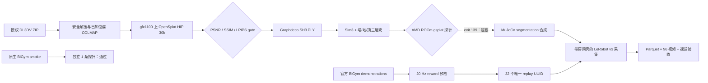

[🇺🇸 English](README.md) | [🇨🇳 中文](README.zh-CN.md)

# End-to-End 3DGS Room Shell for BiGym on AMD ROCm

[](https://github.com/eust-w/amd-bigym-3dgs-rocm/actions/workflows/ci.yml)
[](LICENSE)
[](https://rocm.docs.amd.com/)
[](https://huggingface.co/datasets/eustance/amd-bigym-3dgs-kitchen-shell)

一套从**受许可图片 → AMD gfx1100/HIP 原生 3DGS 重建 → 三层房间壳 →
AMD ROCm 渲染 → BiGym/MuJoCo 32 条 LeRobot 数据采集**的完整开源工程。
历史 A800 结果继续作为对照清单保留，但 AMD 分支不依赖 NVIDIA GPU。

仓库包含真实跑过的重建、导出、坐标对齐、ROCm 适配、视觉合成、回放筛选、
采集、验收和 Gaussian 清理代码；精选派生 PLY 房间壳已作为独立的 Hugging Face
门控数据集公开。受上游条款约束的原图、官方 demonstrations 和 32 条视频数据
仍不进入本仓库，而是通过可审计 manifest、SHA-256 契约和授权下载入口连接到代码。

> 2026-08-04 实测结论：AMD Radeon PRO W7900D（`gfx1100`）上的 OpenSplat
> HIP 30k 重建、保守人工清理、任务感知房间壳导出和源相机原生渲染均已通过；
> 原生 BiGym 与独立 1 条 683 帧 CutleryLong 采集也通过。**BiGym 内实时 3DGS
> 合成仍阻塞**：严格 gsplat 探针以 `139` 退出，因此不能宣称 gfx1100 房间壳
> 采集已经完成。详见[实测执行报告](docs/06-gfx1100-execution-report.md)。


## 实测结果

| 阶段 | 已验证结果 |
| --- | --- |
| 源数据 | DL3DV-ALL-960P，355 张 `960×540` 图片，固定 revision 与 archive SHA |
| A800 重建 | gsplat MCMC，30k steps，1,000,000 Gaussians |
| held-out | PSNR `35.1623` / SSIM `0.9589` / LPIPS `0.1307` |
| AMD 原生重建 | OpenSplat HIP，30k，1,198,821 Gaussian，PSNR `33.8326` / SSIM `0.971857` / LPIPS `0.038427` |
| 人工 visual-safe 清理 | 仅删除 177 个空间离群点；保留 1,198,644 Gaussian；尺度规则经 A/B 复核后否决 |
| CutleryLong 房间壳 | 991,213 Gaussian；中央工作区违规点为 0；OpenSplat 原生视角通过 |
| AMD 原生 BiGym | 32 帧、三相机 smoke 通过 |
| BiGym 实时 3DGS | **阻塞**：严格 gsplat 探针以 `139` 退出，正式房间壳验收未通过 |
| BiGym 任务 | `DishwasherUnloadCutleryLong` |
| AMD 独立 smoke 数据 | 原生模式 1 条、683 帧、回执 `reward=1.0`；不含 3DGS 壳 |
| 历史正式数据 | `32/32` episode、`32/32` 唯一 UUID、全部 `reward=1.0`；A800-parity 归档保持不变 |
| LeRobot v3 | `21,018` frames、`96/96` H.264 视频逐帧解码 |
| 历史 A800 3DGS | `63,150` 次严格渲染，无 fallback |
| 物理隔离 | 新增 body / geom / collision = `0 / 0 / 0` |
| 已发布房间壳 | 4 个 PLY，Hugging Face 门控发布，远端 SHA-256 已验证 |

机器可读证据见 [gfx1100 execution evidence](evidence/gfx1100-20260804-summary.json)、
[A800 reconstruction manifest](data/manifests/a800-reconstruction.public.json)
和 [formal32 validation](evidence/formal32-validation-summary.json)。

## 下载已发布的 3DGS 房间壳

一百万 Gaussian 组合壳、三个可独立加载的墙/地/顶层、坐标对齐、相机路径、
manifest 与预览图均已发布到
[Hugging Face 门控数据集](https://huggingface.co/datasets/eustance/amd-bigym-3dgs-kitchen-shell)。
先在数据集页面申请访问，再使用本地登录态下载：

```bash
hf auth login
hf download eustance/amd-bigym-3dgs-kitchen-shell \
  --repo-type dataset \
  --include 'ply/*' 'metadata/*' 'SHA256SUMS' \
  --local-dir ./data/private/amd-bigym-3dgs-kitchen-shell
cd ./data/private/amd-bigym-3dgs-kitchen-shell
shasum -a 256 -c SHA256SUMS
```

该发布仅限非商业用途，并继续受数据集卡片、当前 DL3DV 条款及上游独立访问
审批约束。

## 架构



3DGS 仅提供视觉背景。机器人、工作台、洗碗机、抽屉和道具继续由 MuJoCo
渲染并参与碰撞、接触和 reward；Gaussian 不进入 MJCF 物理世界。

完整分层说明见 [end-to-end architecture](docs/architecture/end-to-end.md)。

## 60 秒 CPU 验证

无需 GPU 或受限数据即可验证开源包的核心数据契约：

```bash
git clone git@github.com:eust-w/amd-bigym-3dgs-rocm.git
cd amd-bigym-3dgs-rocm
python -m pip install 'numpy>=1.26,<3'
make smoke-reconstruction
make verify
```

CI 会生成一个 Apache-2.0 合成 Gaussian 房间，真实执行 binary PLY 解析、
Sim(3)、墙/地/顶拆分、SHA 记录、中央工作区清空和零物理对象检查。该 smoke
只证明代码结构，不替代 GPU 与视觉验收。

## 完整复现

### 1. 取得并验证源数据

先自行接受 DL3DV 最新条款，再使用本地 Hugging Face 登录态：

精确可复现来源：

- 申请入口：[DL3DV/DL3DV-ALL-960P](https://huggingface.co/datasets/DL3DV/DL3DV-ALL-960P)；
- 固定场景对象：[`3K/951f9d...zip`](https://huggingface.co/datasets/DL3DV/DL3DV-ALL-960P/blob/abb4dab0d4b6d93c32e6d901c06c35bad03210fb/3K/951f9db189a7023708b7798e147e04048a84ce039c5761e8ecb1aa65dcb2da86.zip)；
- revision：`abb4dab0d4b6d93c32e6d901c06c35bad03210fb`；
- archive SHA-256：`4a6f3eac1ff4d2545b655fdfe5c6edd7e08f92e847584fabf933a09e592be563`。

```bash
python -m pip install -r reconstruction/requirements-core.txt
hf auth login
make download-reference-data
```

脚本不接受命令行 token，会核验 revision、字节数、SHA-256、ZIP CRC、图片数和
相机位姿。数据默认进入 Git 忽略的 `data/private/`。

### 2. 在 AMD gfx1100 原生重建

准备固定 revision 的 OpenSplat 与 TheRock/ROCm Python 环境：

```bash
git clone https://github.com/pierotofy/OpenSplat.git /root/OpenSplat
git -C /root/OpenSplat checkout 9fb62fde8b7b8c416121d3cbdcda278ffd9682f7

export ROCM_VENV=/root/opensplat-env
make build-opensplat-rocm

export DATASET_DIR=/workspace/persistent/rocm3dgs-inputs/dl3dv-kitchen
export RUN_ROOT=/workspace/persistent/rocm3dgs-results
export RUN_ID=kitchen-gfx1100-30k
make launch-rocm-30k
```

脚本会拒绝非 `gfx1100` 硬件、不完整 COLMAP 输入、错误的 OpenSplat revision
以及已存在的输出目录，并记录 GPU、HIP、steps、进程状态和最终 PLY SHA-256。
训练完成后仍必须进行 held-out 指标、PLY 健康、坐标对齐和人工视觉验收。
详见 [AMD 原生重建指南](docs/05-amd-native-reconstruction.md)。

### 2b. 历史 A800 对照入口

原 A800/gsplat 路径继续保留，用于复现公开 reference manifest 和后端对照：

```bash
git clone https://github.com/nerfstudio-project/gsplat.git /workspace/gsplat
git -C /workspace/gsplat checkout 4d3a3b69db4de0326f983ccf7b7b255271a17b01

cp .env.example .env
set -a; source .env; set +a
make install-bigym

export SOURCE_ARCHIVE="$PWD/data/private/dl3dv-kitchen/951f9db189a7023708b7798e147e04048a84ce039c5761e8ecb1aa65dcb2da86.zip"
export SOURCE_REPORT="$PWD/data/private/dl3dv-kitchen/source.json"
export GSPLAT_DIR=/workspace/gsplat
export BIGYM_DIR=/workspace/amd-bigym-3dgs/src/bigym
export WORK_ROOT=/workspace/runs/dl3dv-kitchen-a800
make reconstruct
```

入口会完成：

1. 安全解压并把官方位姿转换为 COLMAP；
2. known-pose SIFT 匹配与稀疏初始化；
3. `default` 和 `mcmc` 两个 30k 候选；
4. PSNR ≥ 30、SSIM ≥ 0.92、LPIPS ≤ 0.15 的 fail-closed 选择；
5. Graphdeco SH3 PLY、camera path、MuJoCo OBB、Sim(3) 和三层壳导出；
6. 可选的 BiGym 300-frame 三相机验收。

详见 [reconstruction guide](reconstruction/README.md)。

### 3. 在 AMD Radeon 的 BiGym 中运行房间壳

从 AMD 官方兼容的 ROCm/PyTorch 环境开始：

```bash
make preflight
make build-gsplat

export SHELL_WALLS=/path/to/walls_fixed_kitchen.ply
export SHELL_FLOOR=/path/to/floor_perimeter.ply
export SHELL_CEILING=/path/to/ceiling_lights.ply
make stage-shell
```

`build-gsplat` 固定 `gsplat==1.4.0` 并应用实测 ROCm/gfx1100 补丁。
`scripts/rocm_gsplat_sitecustomize.py` 可以在不修改 site-packages 的前提下加载
已编译扩展，但扩展可导入并不等于端到端通过：当前严格 BiGym 房间壳探针进入
渲染路径后以 `139` 退出。必须等三相机无 fallback 合成通过后，才能启动带壳的
正式采集。详见 [ROCm / gsplat 适配](docs/02-rocm-gsplat.md)。

### 4. 实时房间壳 gate 通过后再采集 Cutlery

先在本地授权的 official demonstrations 上生成 32 个唯一 UUID 并进行无相机
物理回放。`reward=0`、缺失 UUID 或版本漂移后的失败轨迹不得进入正式计划。

```bash
make collect
make validate
```

2026-08-04 的 Radeon 实跑只新增了 1 条隔离的**原生模式** 683 帧数据，回执
`reward=1.0`；它没有覆盖保留的 32 条 A800-parity 归档，也不证明实时 3DGS
采集通过。采集器采用 episode 级事务写入；验收器检查 Parquet、episode metadata、奖励、
状态/动作有限值、视频编码/帧数/逐帧解码、严格渲染次数和 SHA256SUMS。

## 数据边界

| 内容 | Public Git | 门控 Hugging Face | 本地授权目录 |
| --- | :---: | :---: | :---: |
| 数据来源、revision、大小、SHA、许可 | ✅ | ✅ | ✅ |
| 合成 Gaussian CI fixture | 生成器 ✅ | — | ✅ |
| DL3DV 原图/ZIP | ❌ | ❌ | `data/private/` |
| 精选派生 PLY 房间壳 | 仅 manifest | ✅ | 可选缓存 |
| 训练 checkpoint | ❌ | ❌ | 用户自有 artifact store |
| BiGym official demonstrations/UUID | ❌ | ❌ | 用户自有 demo store |
| 32 条 LeRobot 数据/视频 | ❌ | ❌ | 用户自有 dataset root |
| 脱敏统计、精选联系表和清理 A/B | ✅ | 预览图 ✅ | ✅ |

该分层是开源结构的一部分：代码轻量保存在 Git，精选 PLY 通过独立门控数据集
发布，受限上游数据仍由每个使用者独立取得并接受条款。详见
[data plane](data/README.md) 和 [license boundary](docs/data-license.md)。

## 仓库结构

```text
.
├── reconstruction/        # 下载、COLMAP、AMD/A800 训练、PLY/三层壳导出
│   ├── bin/               # 可移植的下载与重建命令
│   ├── src/               # 已实测 Python 实现
│   ├── config/            # 版本与质量阈值
│   └── reference/         # 原始 A800 provenance runner
├── data/
│   ├── manifests/         # 源数据、A800 重建、Cutlery32 数据契约
│   └── samples/           # 合成 smoke 说明，不含受限 PLY
├── patches/               # BiGym、gsplat ROCm 与 OpenSplat HIP 精确补丁
├── scripts/               # AMD 环境、采集、验证、清理和发布检查
├── configs/               # 实测 Sim(3)、视觉 profile、replay schema
├── evidence/              # 脱敏机器证据
├── docs/                  # 架构、ROCm、采集、许可和排障
└── .github/workflows/     # 数据泄漏、语法、patch 和合成重建 CI
```

## 历史 A800 Gaussian 清理

清理始终生成副本，不覆盖权威 PLY：

```bash
python scripts/clean_gaussian_ply.py \
  --input "$SHELL_DIR/walls_fixed_kitchen.ply" \
  --output "$SHELL_DIR-cleaned/walls_fixed_kitchen.ply" \
  --manifest "$SHELL_DIR-cleaned/walls.cleaning.json" \
  --bbox-min=-10,-10,-10 --bbox-max=10,10,10 \
  --max-radius 10 --max-world-scale 0.75 --min-alpha 0.001
```


历史 A800 实验从 1,000,000 个 Gaussian 中保留 772,721 个。清理减少低 alpha
漂浮雾块，但无法修复源视角未覆盖造成的纹理拉伸。gfx1100 本次采用更保守的
规则，只删除 177 个空间离群点，详见
[2026-08-04 实测执行报告](docs/06-gfx1100-execution-report.md)。

## 文档

- [重建流水线](reconstruction/README.md)
- [端到端架构](docs/architecture/end-to-end.md)
- [坐标系与物理隔离](docs/01-end-to-end.md)
- [ROCm / gsplat 适配](docs/02-rocm-gsplat.md)
- [AMD gfx1100 原生重建](docs/05-amd-native-reconstruction.md)
- [AMD gfx1100 实测执行报告](docs/06-gfx1100-execution-report.md)
- [32 条采集与回放失败治理](docs/03-collection.md)
- [完整性验收与异常点清理](docs/04-validation-and-cleaning.md)
- [数据与许可边界](docs/data-license.md)
- [常见故障](docs/troubleshooting.md)

## License and citation

本仓库自有代码采用 [Apache-2.0](LICENSE)。第三方代码和数据继续受各自许可
约束，详见 [NOTICE](NOTICE) 与 [CITATION.cff](CITATION.cff)。本仓库不授予
DL3DV 数据、BiGym demonstrations 或采集视频的再分发权利。独立发布的派生 PLY
遵循其数据集卡片、CC BY-NC 4.0 声明及当前 DL3DV 条款。
