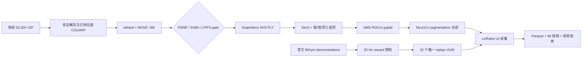

[🇺🇸 English](README.md) | [🇨🇳 中文](README.zh-CN.md)

# End-to-End 3DGS Room Shell for BiGym on AMD ROCm

[](https://github.com/eust-w/amd-bigym-3dgs-rocm/actions/workflows/ci.yml)
[](LICENSE)
[](https://rocm.docs.amd.com/)
[](data/README.md)

一套从**受许可图片 → A800 3DGS 重建 → 三层房间壳 → AMD ROCm 渲染 →
BiGym/MuJoCo 32 条 LeRobot 数据采集**的完整开源工程。

仓库包含真实跑过的重建、导出、坐标对齐、ROCm 适配、视觉合成、回放筛选、
采集、验收和 Gaussian 清理代码；受上游条款约束的原图、完整 PLY、官方
demonstrations 和 32 条视频数据不被重新分发，而是通过可审计 manifest、SHA-256
契约和授权下载入口连接到代码。

> 当前结论：技术链路与精选三相机画面复核均已完成。房间壳、机器人和工作台
> 完整可见；已知限制是固定 H1 头部/腕部相机超出部分源拍摄轨迹，少数低视角
> 仍可能柔化或拉伸。


## 实测结果

| 阶段 | 已验证结果 |
| --- | --- |
| 源数据 | DL3DV-ALL-960P，355 张 `960×540` 图片，固定 revision 与 archive SHA |
| A800 重建 | gsplat MCMC，30k steps，1,000,000 Gaussians |
| held-out | PSNR `35.1623` / SSIM `0.9589` / LPIPS `0.1307` |
| AMD 运行 | Radeon `gfx1100`，ROCm/HIP，gsplat native gate 通过 |
| BiGym 任务 | `DishwasherUnloadCutleryLong` |
| 正式数据 | `32/32` episode、`32/32` 唯一 UUID、全部 `reward=1.0` |
| LeRobot v3 | `21,018` frames、`96/96` H.264 视频逐帧解码 |
| 3DGS | `63,150` 次严格渲染，无 fallback |
| 物理隔离 | 新增 body / geom / collision = `0 / 0 / 0` |

机器可读证据见 [A800 reconstruction manifest](data/manifests/a800-reconstruction.public.json)
和 [formal32 validation](evidence/formal32-validation-summary.json)。

## 架构



3DGS 仅提供视觉背景。机器人、工作台、洗碗机、抽屉和道具继续由 MuJoCo
渲染并参与碰撞、接触和 reward；Gaussian 不进入 MJCF 物理世界。

完整分层说明见 [end-to-end architecture](docs/architecture/end-to-end.md)。

## 60 秒 CPU 验证

无需 GPU 或受限数据即可验证开源包的核心数据契约：

```bash
git clone git@github.com:eust-w/amd-bigym-3dgs-rocm.git
cd amd-bigym-3dgs-rocm
python -m pip install 'numpy>=1.26,<3'
make smoke-reconstruction
make verify
```

CI 会生成一个 Apache-2.0 合成 Gaussian 房间，真实执行 binary PLY 解析、
Sim(3)、墙/地/顶拆分、SHA 记录、中央工作区清空和零物理对象检查。该 smoke
只证明代码结构，不替代 GPU 与视觉验收。

## 完整复现

### 1. 取得并验证源数据

先自行接受 DL3DV 最新条款，再使用本地 Hugging Face 登录态：

精确可复现来源：

- 申请入口：[DL3DV/DL3DV-ALL-960P](https://huggingface.co/datasets/DL3DV/DL3DV-ALL-960P)；
- 固定场景对象：[`3K/951f9d...zip`](https://huggingface.co/datasets/DL3DV/DL3DV-ALL-960P/blob/abb4dab0d4b6d93c32e6d901c06c35bad03210fb/3K/951f9db189a7023708b7798e147e04048a84ce039c5761e8ecb1aa65dcb2da86.zip)；
- revision：`abb4dab0d4b6d93c32e6d901c06c35bad03210fb`；
- archive SHA-256：`4a6f3eac1ff4d2545b655fdfe5c6edd7e08f92e847584fabf933a09e592be563`。

```bash
python -m pip install -r reconstruction/requirements-core.txt
hf auth login
make download-reference-data
```

脚本不接受命令行 token，会核验 revision、字节数、SHA-256、ZIP CRC、图片数和
相机位姿。数据默认进入 Git 忽略的 `data/private/`。

### 2. 在 A800 重建三层壳

```bash
git clone https://github.com/nerfstudio-project/gsplat.git /workspace/gsplat
git -C /workspace/gsplat checkout 4d3a3b69db4de0326f983ccf7b7b255271a17b01

cp .env.example .env
set -a; source .env; set +a
make install-bigym

export SOURCE_ARCHIVE="$PWD/data/private/dl3dv-kitchen/951f9db189a7023708b7798e147e04048a84ce039c5761e8ecb1aa65dcb2da86.zip"
export SOURCE_REPORT="$PWD/data/private/dl3dv-kitchen/source.json"
export GSPLAT_DIR=/workspace/gsplat
export BIGYM_DIR=/workspace/amd-bigym-3dgs/src/bigym
export WORK_ROOT=/workspace/runs/dl3dv-kitchen-a800
make reconstruct
```

入口会完成：

1. 安全解压并把官方位姿转换为 COLMAP；
2. known-pose SIFT 匹配与稀疏初始化；
3. `default` 和 `mcmc` 两个 30k 候选；
4. PSNR ≥ 30、SSIM ≥ 0.92、LPIPS ≤ 0.15 的 fail-closed 选择；
5. Graphdeco SH3 PLY、camera path、MuJoCo OBB、Sim(3) 和三层壳导出；
6. 可选的 BiGym 300-frame 三相机验收。

详见 [reconstruction guide](reconstruction/README.md)。

### 3. 在 AMD Radeon 上运行

从 AMD 官方兼容的 ROCm/PyTorch 环境开始：

```bash
make preflight
make build-gsplat

export SHELL_WALLS=/path/to/walls_fixed_kitchen.ply
export SHELL_FLOOR=/path/to/floor_perimeter.ply
export SHELL_CEILING=/path/to/ceiling_lights.ply
make stage-shell
```

`build-gsplat` 固定 `gsplat==1.4.0`，应用实测的 ROCm/gfx1100 补丁，并真正
渲染一个 64×64 Gaussian 场景；只有 `GATE_OK True` 才允许继续。

### 4. 采集 Cutlery 32 条

先在本地授权的 official demonstrations 上生成 32 个唯一 UUID 并进行无相机
物理回放。`reward=0`、缺失 UUID 或版本漂移后的失败轨迹不得进入正式计划。

```bash
make collect
make validate
```

采集器采用 episode 级事务写入；验收器检查 Parquet、episode metadata、奖励、
状态/动作有限值、视频编码/帧数/逐帧解码、严格渲染次数和 SHA256SUMS。

## 数据边界

| 内容 | Public Git | 本地授权目录 |
| --- | :---: | :---: |
| 数据来源、revision、大小、SHA、许可 | ✅ | ✅ |
| 合成 Gaussian CI fixture | 生成器 ✅ | ✅ |
| DL3DV 原图/ZIP | ❌ | `data/private/` |
| 完整派生 PLY/checkpoint | ❌ | 用户自有 artifact store |
| BiGym official demonstrations/UUID | ❌ | 用户自有 demo store |
| 32 条 LeRobot 数据/视频 | ❌ | 用户自有 dataset root |
| 脱敏统计、精选联系表和清理 A/B | ✅ | ✅ |

这里的“不上传”不是缺文件，而是开源结构的一部分：代码与数据契约公开，受限
数据由每个使用者独立取得并接受上游条款。详见 [data plane](data/README.md)
和 [license boundary](docs/data-license.md)。

## 仓库结构

```text
.
├── reconstruction/        # 下载、COLMAP、训练选择、PLY/三层壳导出、A800 实验入口
│   ├── bin/               # 可移植的下载与重建命令
│   ├── src/               # 已实测 Python 实现
│   ├── config/            # 版本与质量阈值
│   └── reference/         # 原始 A800 provenance runner
├── data/
│   ├── manifests/         # 源数据、A800 重建、Cutlery32 数据契约
│   └── samples/           # 合成 smoke 说明，不含受限 PLY
├── patches/               # BiGym 视觉壳与 gsplat ROCm 精确补丁
├── scripts/               # AMD 环境、采集、验证、清理和发布检查
├── configs/               # 实测 Sim(3)、视觉 profile、replay schema
├── evidence/              # 脱敏机器证据
├── docs/                  # 架构、ROCm、采集、许可和排障
└── .github/workflows/     # 数据泄漏、语法、patch 和合成重建 CI
```

## Gaussian 清理

清理始终生成副本，不覆盖权威 PLY：

```bash
python scripts/clean_gaussian_ply.py \
  --input "$SHELL_DIR/walls_fixed_kitchen.ply" \
  --output "$SHELL_DIR-cleaned/walls_fixed_kitchen.ply" \
  --manifest "$SHELL_DIR-cleaned/walls.cleaning.json" \
  --bbox-min=-10,-10,-10 --bbox-max=10,10,10 \
  --max-radius 10 --max-world-scale 0.75 --min-alpha 0.001
```


实验中从 1,000,000 个 Gaussian 中保留 772,721 个。清理减少低 alpha 漂浮
雾块，但无法修复源视角未覆盖造成的纹理拉伸。

## 文档

- [重建流水线](reconstruction/README.md)
- [端到端架构](docs/architecture/end-to-end.md)
- [坐标系与物理隔离](docs/01-end-to-end.md)
- [ROCm / gsplat 适配](docs/02-rocm-gsplat.md)
- [32 条采集与回放失败治理](docs/03-collection.md)
- [完整性验收与异常点清理](docs/04-validation-and-cleaning.md)
- [数据与许可边界](docs/data-license.md)
- [常见故障](docs/troubleshooting.md)

## License and citation

本仓库自有代码采用 [Apache-2.0](LICENSE)。第三方代码和数据继续受各自许可
约束，详见 [NOTICE](NOTICE) 与 [CITATION.cff](CITATION.cff)。本仓库不授予
DL3DV 数据、派生 PLY、BiGym demonstrations 或采集视频的再分发权利。
