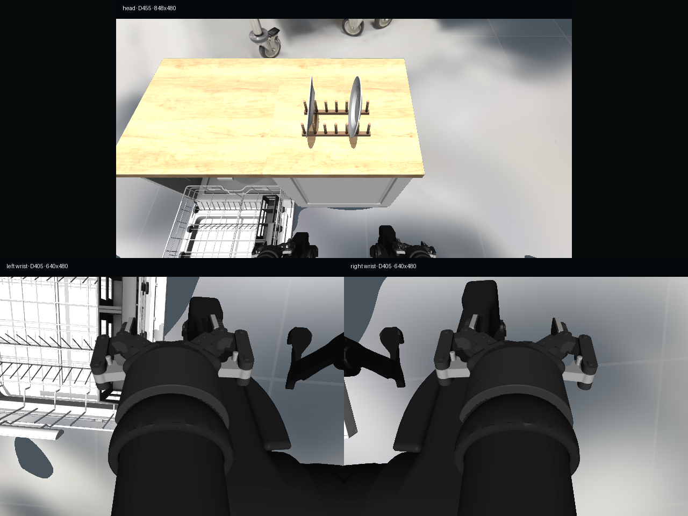

# AMD Radeon BiGym + 3DGS 厨房环境

[English](README.md) | [中文](README.zh-CN.md) ·
[AMD/ROCm `main`](https://github.com/eust-w/amd-bigym-3dgs-rocm/tree/main) ·
[A800/CUDA `a800`](https://github.com/eust-w/amd-bigym-3dgs-rocm/tree/a800)

这是面向 AMD Radeon/ROCm 的主分支，用于在 BiGym
`DishwasherUnloadCutleryLong` 中加载纯视觉 3D Gaussian Splatting 厨房壳，
完成回放、采集和校验。已经验证的 NVIDIA A800/CUDA 参考版本原样保存在
[`a800` 分支](https://github.com/eust-w/amd-bigym-3dgs-rocm/tree/a800)。

两个分支只认同一份标准数据和 shell，已废弃的场景与采集身份不再支持。

## 标准素材预览

| 对齐后的 3DGS 房间壳 | 上游轨迹抽样视图 |
| --- | --- |
|  |  |


GIF 来自已经校验的 `cam_high` 合并视频，仅作为仓库内可直接查看的素材证据，
不能替代受控下载的完整视频，也不能替代三相机人工视觉验收。

### AMD Radeon 实机复现


左侧是 `1920x1080` 留出原图，右侧是 AMD Radeon PRO W7900D 上
OpenSplat/HIP 训练 15,000 steps 的渲染结果。清晰预览门禁以 PSNR
`27.9066`、SSIM `0.9370` 通过；导出 shell 前已去除明显投影拉丝点和
1 个所有相机均不可见的空间离群点。

## 分支与证据边界

| 分支或产物 | 硬件阶段 | 当前结论 |
| --- | --- | --- |
| `main` | AMD Radeon PRO W7900D `gfx1100`、ROCm/HIP | 352 张标准图像的重建已实机复现；清理后 PLY、清晰留出渲染和零碰撞房间壳门禁通过 |
| `a800` | NVIDIA A800、CUDA 12.8 | 已锁定参考版本：房间壳重建和 32 条采集通过技术校验 |
| Hugging Face 数据 | 由 A800 生成 | 32 个 episode、3 个合并相机视频；视觉状态为 `awaiting_visual_approval` |
| Hugging Face shell | A800 `main` + AMD 独立分支 | 保留 A800 参考，在独立 HF 分支发布 AMD PLY、分层、alignment、回执和预览 |

标准房间重建现在已在 Radeon 上实机复现。但这**不代表** A800 的
32 条采集已经在 AMD 上重放：后续采集验收仍要通过原生 gsplat
rasterization、严格三相机回放、全视频解码和独立人工视觉检查。

机器可读状态见
[`evidence/amd-rocm-main-status.json`](evidence/amd-rocm-main-status.json)，
A800 基线见
[`evidence/a800-reference-validation-summary.json`](evidence/a800-reference-validation-summary.json)。

## 唯一标准输入

| 内容 | 唯一标准 |
| --- | --- |
| LeRobot v3 参考数据 | [eustance/openSource_AMD_AI_DevMaster_Hackathon_202608](https://huggingface.co/datasets/eustance/openSource_AMD_AI_DevMaster_Hackathon_202608) |
| 数据路径 | `bigym-3dgs-light-floor-replay-plan-v2-20260802/dishwasher_unload_cutlery_long` |
| 3DGS 房间壳 | [eustance/amd-bigym-3dgs-kitchen-shell](https://huggingface.co/datasets/eustance/amd-bigym-3dgs-kitchen-shell) |
| DL3DV 来源 | [DL3DV/DL3DV-ALL-2K](https://huggingface.co/datasets/DL3DV/DL3DV-ALL-2K)，revision `e035bc5efd8dc5b2fa1e704cb2b1086fd9ec2c5c` |
| Scene hash | `90e70328f9196bc78c7e6c695c1e8cbb55a3c961cccf34c566966a5e2d8d8947` |
| 合并 shell | 862,104 个 Gaussian，SHA-256 `086f1f5757523db94349de16707806e74a65bac35b24d9e4e7437639164738a7` |
| AMD 清理后重建 | 1,458,354 个 Gaussian，SHA-256 `d49bcf7219f63a92ee0d40f8d86e618176892ec89853fecc5e217829bff42b9b` |
| AMD shell 完整包 | [HF 分支 `amd-rocm-w7900d-20260804`](https://huggingface.co/datasets/eustance/amd-bigym-3dgs-kitchen-shell/tree/amd-rocm-w7900d-20260804) |

由于标准素材继续受 DL3DV 和其他上游条款约束，两个 Hugging Face 仓库保持
人工审批下载。

## AMD/ROCm 快速开始

目标环境：

- 能报告 `gfx1100` 的 AMD Radeon GPU；
- AMD Radeon `gfx1100` 上的 ROCm PyTorch；
- 重建使用 OpenSplat commit
  `9fb62fde8b7b8c416121d3cbdcda278ffd9682f7`；
- 下游运行时渲染使用 Python 3.12、MuJoCo 3.10、BiGym 4.1 和
  gsplat 1.4。

先构建 OpenSplat 原生 HIP trainer，下载精确锁定的受控源包，然后运行 AMD
端到端重建：

```bash
git clone https://github.com/pierotofy/OpenSplat.git /root/OpenSplat
git -C /root/OpenSplat checkout --detach \
  9fb62fde8b7b8c416121d3cbdcda278ffd9682f7
export OPENSPLAT_SOURCE=/root/OpenSplat
make build-opensplat

hf auth login
make download-reference-data
cp reconstruction/config/rocm.env.example .rocm.env
set -a && source .rocm.env && set +a
make reconstruct-rocm
```

只有回执状态为 `amd_rocm_reproduction_passed` 才算重建通过；精确门禁见
[`reconstruction/README.md`](reconstruction/README.md)。

下载受控的标准 shell，根据
[`data/manifests/a800-reconstruction.public.json`](data/manifests/a800-reconstruction.public.json)
核对哈希，然后生成 AMD 运行目录：

```bash
hf auth login
hf download eustance/amd-bigym-3dgs-kitchen-shell \
  --repo-type dataset --local-dir data/private/canonical-shell

export SHELL_WALLS="$PWD/data/private/canonical-shell/walls_fixed_kitchen.ply"
export SHELL_FLOOR="$PWD/data/private/canonical-shell/floor_perimeter.ply"
export SHELL_CEILING="$PWD/data/private/canonical-shell/ceiling_lights.ply"
export SHELL_DIR="$PWD/data/private/amd-runtime-shell"
make stage-shell
```

只有原生 AMD 渲染门禁通过后，才能运行 32 条标准 replay plan：

```bash
export REPLAY_PLAN=/absolute/path/to/cutlery32-replay-plan.json
export DATASET_ROOT=/absolute/path/to/amd-cutlery32
make collect
make validate
```

回放失败必须继续排除；已发布的 AMD 重建回执不会将独立的
32 条回放阶段误标为通过。

## 已实现内容

- 不修改 `/opt/rocm` 的隔离编译器 wrapper；
- 在 `gfx1100` 上锁定 OpenSplat 原生 HIP 重建；
- held-out PSNR/SSIM 与保守的全相机不可见异常点清理；
- `gsplat==1.4.0` `gfx1100` 兼容补丁和真实 rasterization smoke；
- 不增加 MuJoCo 物理对象的 BiGym 纯视觉 shell 合成；
- 禁止 fallback 的 head、左右腕部三相机严格渲染；
- 不同 demonstration 的 replay plan 校验；
- LeRobot v3 结构、有限数值和全视频解码校验；
- CI 使用的无数据许可 CPU 合成重建 smoke。

ROCm 构建边界见 [`docs/02-rocm-gsplat.md`](docs/02-rocm-gsplat.md)，坐标与
合成路径见 [`docs/01-end-to-end.md`](docs/01-end-to-end.md)。

## 仓库校验

```bash
make verify
make smoke-reconstruction
python scripts/check_markdown_links.py
```

GitHub CI 会检查公开文件哈希、JSON 契约、两个补丁、Markdown 链接和无许可依赖
的 shell exporter；真实 Radeon GPU 结果另有机器可读回执和不可变哈希。

## 许可

代码默认采用 Apache-2.0。DL3DV 源数据、派生房间壳、预览和采集画面继续受
CC BY-NC 4.0 与 DL3DV 现行条款约束；BiGym demonstrations 保留上游许可。
