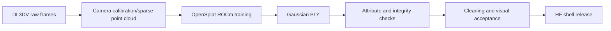

# 3D reconstruction

This project keeps two reconstruction routes: AMD W7900D/ROCm is the main production path, while reference path provides cross-platform comparison.

## Inputs and outputs

Inputs are DL3DV scene images, camera intrinsics/extrinsics, and sparse point cloud; outputs are Gaussian PLY containing position, scale, rotation, opacity, and SH coefficients. Any reconstruction artifact must continue through cleaning, Sim(3) alignment, and visual acceptance before BiGym use.

## AMD main route

| Item | Locked value |
| --- | --- |
| Orchestration repo | `eust-w/amd-bigym-3dgs-rocm` |
| Run baseline | `main@f66b9150ca7cfd48746147dfa8326a2657ab309e` |
| Reconstruction engine | `pierotofy/OpenSplat` |
| Upstream source branch | `main` |
| Execution commit | `9fb62fde8b7b8c416121d3cbdcda278ffd9682f7`, run as detached HEAD |
| Project patches | `reconstruction/patches/opensplat-rocm-home.patch`, `reconstruction/patches/opensplat-force-rocm-include.patch` |
| Data revision | `DL3DV/DL3DV-ALL-2K@e035bc5efd8dc5b2fa1e704cb2b1086fd9ec2c5c` |
| Release revision | `eustance/amd-bigym-3dgs-kitchen-shell@amd-rocm-w7900d-20260804` |

This route's GPU work includes Gaussian parameter optimization, projection, sorting, rasterization, visibility, and gradient backpropagation. Image prep, manifest generation, PLY checks, packaging, and document generation are primarily CPU.

## Reference route

| Repo | Source branch | Execution commit | Purpose |
| --- | --- | --- | --- |
| `eust-w/amd-bigym-3dgs-rocm` | `reference` | `b35e318f4dfcfabaaeedd8347c6101384cd7c14d` | Cross-platform comparison orchestration and reference evidence |
| `nerfstudio-project/gsplat` | `main` | `4d3a3b69db4de0326f983ccf7b7b255271a17b01` | Reference reconstruction/rendering, detached HEAD |
| `discoverse-dev/DISCOVERSE` | `main` | `d67f47c084aba0e0cf422a8725235f8b9238655a` | Reference runtime integration, detached HEAD |

The `reference` branch is used only for path consistency checks, parameter review, and cross-platform comparison; it is not a substitute for the AMD mainline.
Reference branch results support troubleshooting for data, camera, or visual quality problems, but cannot replace ROCm mainline proof.

## GPU + VRAM observations

Data is collected from [`AMD Radeon 3DGS x BiGym GPU and Memory Analysis (2026-08-06)`](https://horizonrobotics.feishu.cn/wiki/OD83w2tcgid39wk3hCgc2lyynkd) and is used to supplement historical-stage evidence. These values are **historical measurements + scenario estimates** from different image resolutions, sample counts, and concurrency settings; they should not be merged as a single production baseline.

### Per-stage observed range (historical/estimated)

| Stage | Evidence type | VRAM | GPU utilization | Notes |
| --- | --- | --- | --- | --- |
| Server idle snapshot | On-site measurement, 2026-08-06 | `991,496,616 B` (~`0.92 GiB`, ~`1.9% / 48GB`) | `6%` | No reconstruction/collection/evaluation processes running; only an idle baseline. |
| Historical OpenSplat ROCm training | Historical measurement, mixed scale | ~`2.1 GiB` | Peak around `97%` | `332` images @`960x540`, `10k` steps, `816,948 Gaussians`; cannot be extrapolated as exact peak for current `1080p 15k` run. |
| Current OpenSplat training | Historical measurement, mixed scale | ~`3-8 GiB`, `6%-17%` | Main training loop around `80%-100%` | `352` images @`1080p`, `1.46M Gaussians`; requires direct sampling to confirm. |
| BiGym triple-camera gsplat + EGL | Historical measurement, mixed scale | ~`3-8 GiB`, `6%-17%` | ~`30%-90%` | Rendering peaks interleave with CPU encoding and disk write phases. |
| Closed-loop evaluator endpoint | Historical measurement, mixed scale | ~`3-8 GiB`, `6%-17%` | ~`20%-80%` | HTTP waits and policy latency pull down average busy. |
| External 7B BF16 VLA reference | Deployment scenario estimate | ~`16-28 GiB`, `33%-58%` | ~`50%-100%` during requests | Model is not in this repo; quantization, batch size, and KV cache significantly change values. |
| One W7900D shared by simulator + 7B inference | Deployment scenario estimate | ~`19-36 GiB` | Combined ~`50%-100%` | Must pass shared-GPU smoke memory gate first. |

Formal re-measurement requires at minimum:

- Periodic sampling with `rocm-smi --showuse --showmemuse --showpower --showtemp --json` (aligned to training logs).
- Train config, image count/resolution, Gaussian count, iteration count, batch trajectory, and sampling interval.
- GPU busy and VRAM median, P95, and peak with alignment to `step`, frame index, and episode boundaries.
- Separate sampling scope for "inference GPU" and "render GPU" in shared-GPU scenarios to avoid conflating workloads.

Without continuous sampling under identical configuration, only qualitative conclusions are possible: reconstruction training and 3DGS rendering are high-GPU stages; dataset download, COLMAP pre/post-processing, PLY cleaning, and packaging are generally not sustained high-GPU stages.

## Acceptance gates

1. The process must really load ROCm/HIP backend, not CPU fallback.
2. Training logs must contain continuous valid iterations and successfully write final PLY.
3. PLY attributes, point count, file size, and hashes must be auditable.
4. At least training-view and free-view rendering checks must pass; parsing a valid PLY alone does not imply visual acceptance.
5. Release revision and local acceptance artifacts must be one-to-one.

For full versioning, see [phase, repository, branch, and commit ledger](08-repository-revisions.md).
