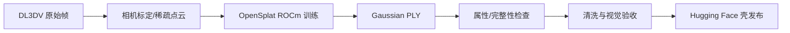

# 3D 重建

本项目保留两条重建路径：AMD W7900D/ROCm 是项目主路径，A800/CUDA 仅作为参考实现和对照证据。

## 输入与输出

输入是 DL3DV 场景的图像、相机内外参和稀疏点云；输出是包含位置、尺度、旋转、不透明度和球谐系数的 Gaussian PLY。重建产物要进入 BiGym，必须继续经过清洗、坐标对齐和视觉验收。

## AMD 主路径

| 项目 | 锁定值 |
| --- | --- |
| 编排仓库 | `eust-w/amd-bigym-3dgs-rocm` |
| 运行基线 | `main@f66b9150ca7cfd48746147dfa8326a2657ab309e` |
| 重建引擎 | `pierotofy/OpenSplat` |
| 上游源分支 | `main` |
| 执行 commit | `9fb62fde8b7b8c416121d3cbdcda278ffd9682f7`，以 detached HEAD 运行 |
| 本项目补丁 | `reconstruction/patches/opensplat-rocm-home.patch`、`reconstruction/patches/opensplat-force-rocm-include.patch` |
| 数据 revision | `DL3DV/DL3DV-ALL-2K@e035bc5efd8dc5b2fa1e704cb2b1086fd9ec2c5c` |
| 发布 revision | `eustance/amd-bigym-3dgs-kitchen-shell@amd-rocm-w7900d-20260804` |

该路径的 GPU 工作包括 Gaussian 参数优化、投影、排序、光栅化、可见性计算和梯度反传。图像准备、清单生成、PLY 属性检查、文件打包和文档生成主要使用 CPU。

## A800 参考路径

| 仓库 | 源分支 | 执行 commit | 用途 |
| --- | --- | --- | --- |
| `eust-w/amd-bigym-3dgs-rocm` | `a800` | `b35e318f4dfcfabaaeedd8347c6101384cd7c14d` | CUDA 参考编排与证据 |
| `nerfstudio-project/gsplat` | `main` | `4d3a3b69db4de0326f983ccf7b7b255271a17b01` | 参考重建/渲染，detached HEAD |
| `discoverse-dev/DISCOVERSE` | `main` | `d67f47c084aba0e0cf422a8725235f8b9238655a` | 参考运行时集成，detached HEAD |

`a800` 是参考分支，不是 AMD 主线的替代品。A800 结果可用于排查数据、相机或视觉质量问题，但不能作为 ROCm 运行成功的证据。

## GPU 与显存观测

仓库现有证据能够确认 GPU 路径和设备类型，但没有形成覆盖每一阶段的统一时序遥测。因此本文不把单点峰值伪装成稳定占用率。正式复测时应同时记录：

- `rocm-smi --showuse --showmemuse --showpower --showtemp --json` 的周期采样。
- 训练配置、图像数量/分辨率、Gaussian 数量、迭代数和 batch 行为。
- GPU busy 的中位数、P95 和峰值；VRAM 已用量的中位数和峰值。
- 采样开始/结束时间，并与训练日志中的迭代区间对齐。

在没有同一配置下的连续采样前，只能定性判断：重建训练和 3DGS 渲染是高 GPU 环节；数据下载、COLMAP 前后处理、PLY 清洗与打包通常不是持续高 GPU 环节。

## 验收门槛

1. 进程确实加载 ROCm/HIP 后端，而不是 CPU fallback。
2. 训练日志包含连续有效迭代，并成功写出最终 PLY。
3. PLY 属性、点数、文件大小和哈希可审计。
4. 至少完成训练视角和自由视角渲染检查；仅“PLY 可解析”不代表视觉质量通过。
5. 发布 revision 与本地验收产物一一对应。

完整版本关系见 [阶段、仓库、分支与 commit 台账](08-repository-revisions.md)。

