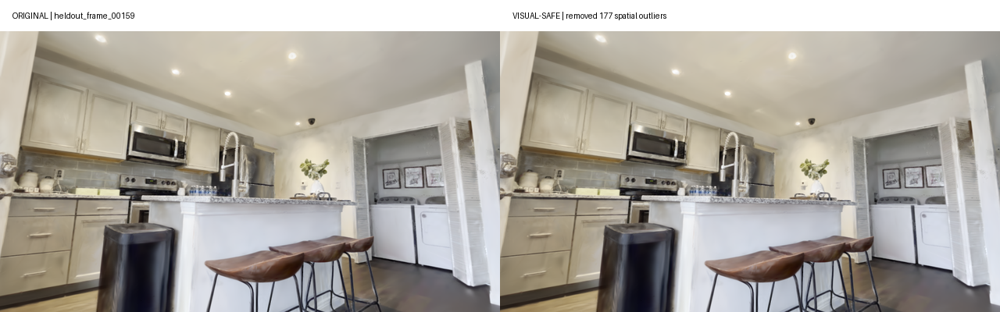
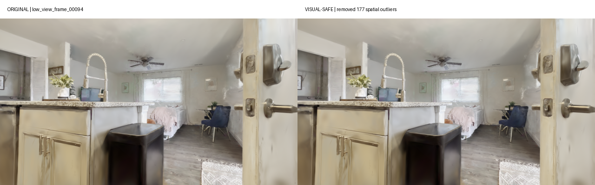
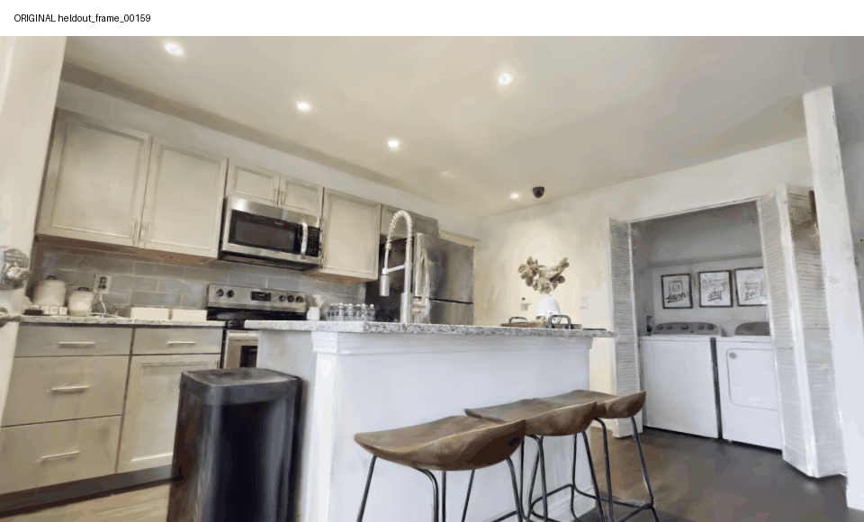
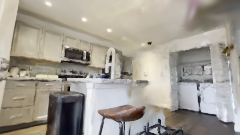
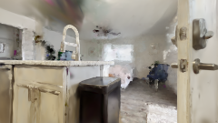
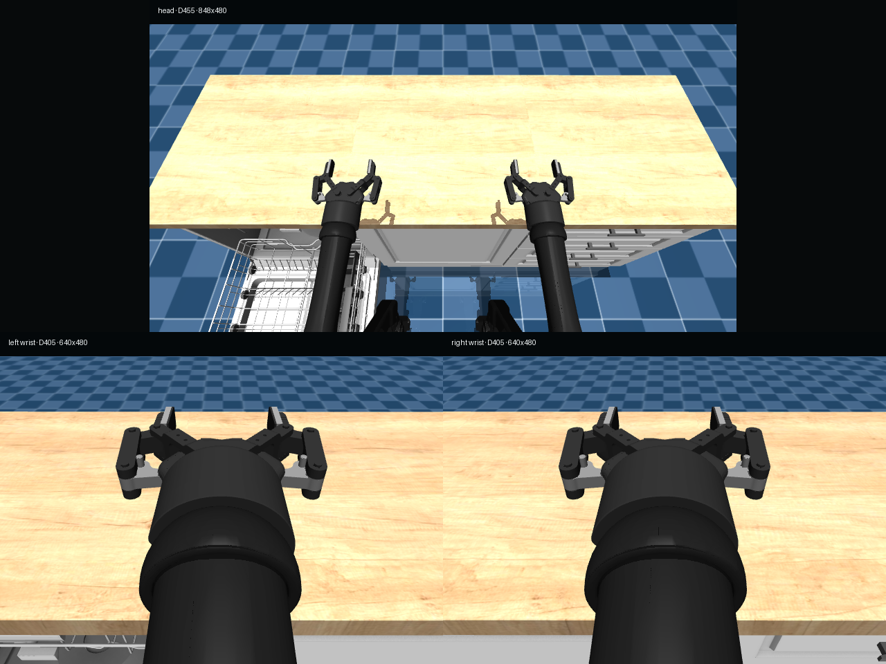
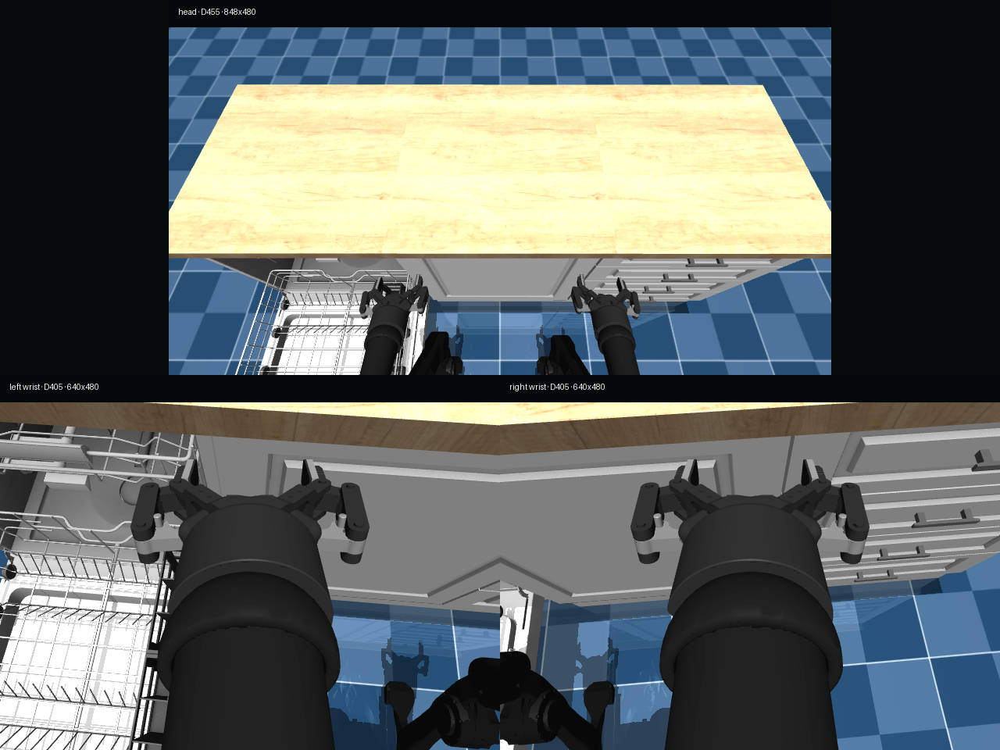

[🇺🇸 English](06-gfx1100-execution-report.md) | [🇨🇳 中文](06-gfx1100-execution-report.zh-CN.md)

# AMD gfx1100 execution report — 2026-08-04

This report records the measured state of the Radeon-native reconstruction,
manual Gaussian cleanup, task-aware shell export, BiGym runtime probe, and an
independent `DishwasherUnloadCutleryLong` collection smoke. It deliberately
keeps reconstruction quality, shell rendering, live compositing, and dataset
collection as separate acceptance gates.

The machine-readable companion is
[`evidence/gfx1100-20260804-summary.json`](../evidence/gfx1100-20260804-summary.json).

## Result at a glance

| Gate | Result | Evidence |
| --- | --- | --- |
| OpenSplat HIP 30k reconstruction | **Passed** | PSNR `33.8326`, SSIM `0.971857`, LPIPS `0.038427` |
| Conservative manual cleanup | **Passed** | 177 obvious spatial outliers removed; original preserved |
| CutleryLong three-layer shell export | **Passed** | 991,213 Gaussians, zero central-workspace violations |
| Native OpenSplat shell render | **Passed** | held-out and low-view source-camera renders |
| Native BiGym/MuJoCo smoke | **Passed** | 32 frames, three cameras, no termination |
| Live 3DGS compositing inside BiGym | **Blocked** | gsplat-backed probe exits `139` |
| Independent native CutleryLong episode | **Passed** | 683 frames, three H.264 videos, receipt reward `1.0` |
| 3DGS-shell-backed collection | **Not run** | blocked by the live compositor gate |

## 1. Source and Radeon-native reconstruction

The run used scene
`951f9db189a7023708b7798e147e04048a84ce039c5761e8ecb1aa65dcb2da86`
from [DL3DV-ALL-960P](https://huggingface.co/datasets/DL3DV/DL3DV-ALL-960P)
at revision `abb4dab0d4b6d93c32e6d901c06c35bad03210fb`. OpenSplat loaded
331 training images and held out `frame_00159.png` from the 332 registered
views. The 30k HIP run executed on an AMD Radeon PRO W7900D (`gfx1100`) using
OpenSplat commit `9fb62fde8b7b8c416121d3cbdcda278ffd9682f7`.

The final PLY contains 1,198,821 Gaussians, is 297,309,190 bytes, and has
SHA-256 `208cbbb9c69c6319e42da2828b37ac816556b6acb48828164507ca82d302b57d`.

## 2. Manual cleanup and visual review

Cleanup always wrote a new PLY. The accepted rule removed only 177 spatial
outliers. A second rule targeting 79 unusually large Gaussians was rejected
because it produced a clearly visible purple floor residual. The accepted
visual-safe copy contains 1,198,644 Gaussians and has SHA-256
`a1fb19bbb45f4dcf0f39fbc2ad38230a592409fd8acf51af78f530f4a5d10a7a`.

## 3. Task-aware CutleryLong shell

The shell exporter measured the MuJoCo task geometry instead of relying on a
generic centered box. The raw task workspace is centered at
`[0.4934, -0.6228]` metres, with a 1.8365 m × 2.5988 m footprint and 2.4 m
clear height. After the safety margin, the exporter retained 82.6945% of the
visual-safe reconstruction and reported zero visible Gaussians inside the
protected workspace volume.

The resulting shell has 886,194 wall/decor Gaussians, 13,909 perimeter-floor
Gaussians, and 91,110 ceiling/light Gaussians. The combined 991,213-Gaussian
PLY has SHA-256
`c277948cf584397e8fc7a7524df61fe845718d200491ea4ffa39345d98e9d50f`.
OpenSplat HIP rendered both a held-out and a low source-camera view successfully:

| Held-out view | Low view |
| --- | --- |
|  |  |

## 4. BiGym runtime boundary

Native `DishwasherUnloadCutleryLong` ran for 32 frames with the 16-dimensional
action contract, three RGB cameras, a maximum of three contacts, and no
termination. These screenshots show the native procedural BiGym environment;
they do **not** claim that the 3DGS background was composited.

| Native initial frame | Native final frame |
| --- | --- |
|  |  |

The prebuilt ROCm gsplat extension imports and exposes the required symbols,
but the real shell-backed BiGym probe terminates with exit code `139` after
entering the gsplat rendering path. Consequently, the live compositor gate is
**blocked**, formal shell acceptance is **not passed**, and no shell-backed
dataset is reported as complete.

`scripts/rocm_gsplat_sitecustomize.py` provides an opt-in loader for an already
built extension without modifying site-packages. It is a diagnostic/bootstrap
tool, not evidence that the rendering gate passed.

## 5. Independent collection smoke

An isolated native BiGym collection wrote one successful episode without
touching the retained 32-episode archive. The episode contains 683 frames, one
Parquet data file, and three H.264 camera videos totalling 16,596,729 bytes.
The run receipt records `reward=1.0`; reward is not asserted to be a Parquet
column. The real demonstration UUID and the videos remain in the authorized
artifact store and are not published by this repository.

The historical 32-episode archive remains unchanged at 484,207,348 bytes. It is
an A800-parity dataset and must not be described as output from this blocked
gfx1100 live-3DGS path.

## 6. Next engineering gate

The next step is to isolate the gfx1100 failure with a minimal
`fully_fused_projection` reproducer, rebuild gsplat against the exact runtime
Torch/HIP ABI, and rerun the strict three-camera shell probe. Only after that
probe produces composed frames with no fallback should the 32-episode
shell-backed collection be started.
