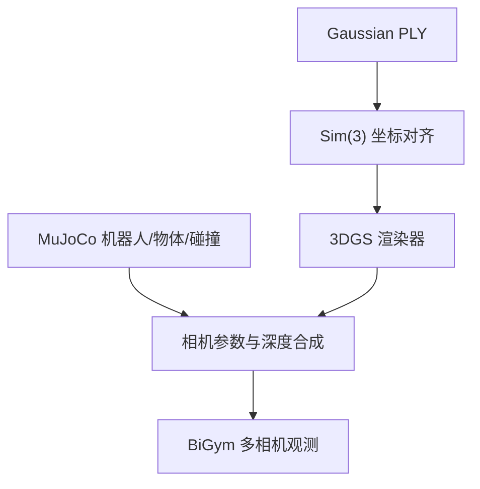

# Gaussian 壳导入

壳导入的目标是把重建得到的 Gaussian 场景作为 BiGym/MuJoCo 的视觉背景，同时保持机器人、任务物体和碰撞系统仍由 MuJoCo 负责。

## 系统边界

- Gaussian 壳负责视觉外观，不创建 MuJoCo body、geom 或 collision。
- 机器人和可交互物体仍由 MuJoCo 渲染并计算动力学。
- 对齐变换必须显式记录为 Sim(3)：尺度、旋转和平移。
- 相机外参、坐标轴方向、近远裁剪面和 FOV 必须与 BiGym 观测配置一致。

## 锁定依赖

| 仓库/资源 | 源分支或 revision | 执行 commit/版本 | 作用 |
| --- | --- | --- | --- |
| `eust-w/amd-bigym-3dgs-rocm` | `main` | `f66b9150ca7cfd48746147dfa8326a2657ab309e` | 壳资源、补丁和编排 |
| `NeuracoreAI/bigym` | `master` | `14beb30318ad14c5d6723175c2ee2281129792af` | BiGym 基线，detached HEAD |
| 本项目 BiGym overlay | `patches/bigym-3dgs-shell-and-collector.patch` | 随项目运行基线锁定 | 视觉壳、相机和采集接入 |
| Gaussian 壳 | `amd-rocm-w7900d-20260804` | Hugging Face revision | 已发布的 AMD 重建资产 |

## 导入流程

1. 校验 PLY 文件、必要属性、哈希和资源 revision。
2. 加载项目配置中的壳资产，并应用 Sim(3) 对齐参数。
3. 从 BiGym/MuJoCo 获取每个相机的内外参、分辨率和裁剪范围。
4. 分别渲染 Gaussian 背景与 MuJoCo 前景，再按项目实现合成观测。
5. 在头部/双目或任务相机上执行静态帧、运动帧和遮挡检查。
6. 确认壳没有进入物理碰撞树，也没有改变原任务动力学。

## GPU 使用边界

Gaussian 的投影、排序和光栅化使用 GPU；MuJoCo 物理步进主要使用 CPU。多相机、高分辨率和每步都渲染会提高 GPU busy 和显存占用，但实际数值取决于可见 Gaussian 数量、分辨率、相机数量和渲染后端。当前证据没有提供可复用的连续显存/GPU 利用率统计，因此不在文档中给出未经测量的百分比。

## 验收门槛

- 相机画面能看到完整外壳，而不是仅有前视图或局部贴片。
- 运动时没有明显坐标漂移、尺度错误、左右目交换或前后景穿插错误。
- MuJoCo 物体和机器人保持可见、可交互，碰撞行为与无壳基线一致。
- 静态截图、短视频、配置快照和资产 revision 一并留存。
- 壳导入通过不代表采集成功，也不代表策略闭环成功。

更详细的坐标与物理边界见 [端到端说明](01-end-to-end.md)。

