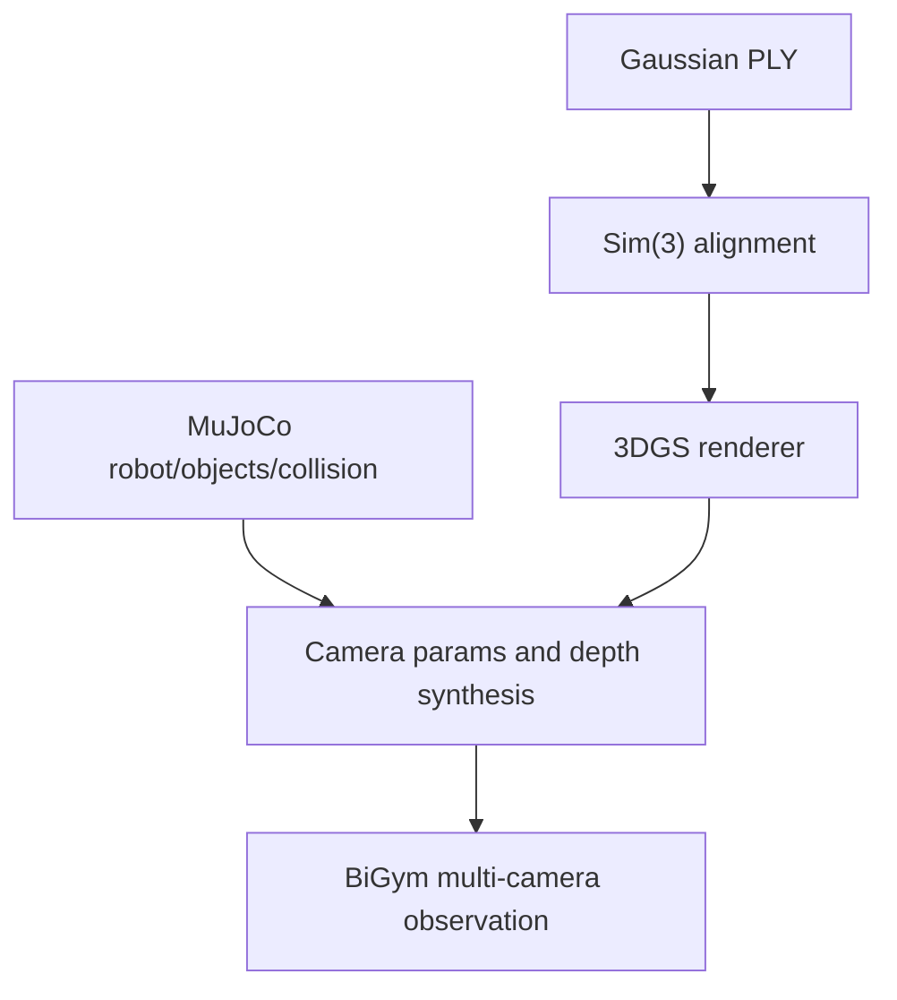

# Gaussian shell import

Shell import aims to use the reconstructed Gaussian scene as BiGym/MuJoCo visual background while keeping robot, task objects, and collision system in MuJoCo.

## System boundary

- Gaussian shell is visual appearance only and does not create MuJoCo body, geom, or collision objects.
- Robot and interactive objects are still rendered and simulated by MuJoCo dynamics.
- Alignment transform must be explicitly recorded as Sim(3): scale, rotation, and translation.
- Camera extrinsics, axis orientation, near/far clipping planes, and FOV must match BiGym observation configuration.

## Locked dependencies

| Repo/resource | Source branch or revision | Execution commit/version | Role |
| --- | --- | --- | --- |
| `eust-w/amd-bigym-3dgs-rocm` | `main` | `f66b9150ca7cfd48746147dfa8326a2657ab309e` | Shell assets, patches, and orchestration |
| `NeuracoreAI/bigym` | `master` | `14beb30318ad14c5d6723175c2ee2281129792af` | BiGym baseline, detached HEAD |
| Project BiGym overlay | `patches/bigym-3dgs-shell-and-collector.patch` | Locked with project baseline | Visual shell, camera, and collection integration |
| Gaussian shell | `amd-rocm-w7900d-20260804` | Hugging Face revision | Released AMD reconstruction asset |

## Import process

1. Validate PLY files, required attributes, hashes, and resource revision.
2. Load shell asset from project config and apply Sim(3) alignment parameters.
3. Read each camera's pose, resolution, and clipping ranges from BiGym/MuJoCo.
4. Render Gaussian background and MuJoCo foreground separately, then composite observations.
5. Run static-frame, motion-frame, and occlusion checks on head/stereo/task cameras.
6. Confirm shell never enters physical collision tree and does not change original task dynamics.

## GPU utilization boundary

Gaussian projection, sorting, and rasterization use GPU; MuJoCo physics stepping is primarily CPU. Multi-camera pipelines, high resolution, and per-step rendering increase GPU busy and VRAM, while absolute values depend on visible Gaussians, resolution, camera count, and render backend.

For this section, reuse the corresponding historical ranges in [`docs/05-3d-reconstruction.md`](05-3d-reconstruction.md) under GPU + VRAM observations: `BiGym triple-camera gsplat + EGL`, `External 7B BF16 VLA reference`, and `One W7900D shared by simulator + 7B inference`.

## Acceptance gates

- Camera views should show a complete shell, not only front-view or local patches.
- No obvious drift, scale error, eye swap, or foreground/background ordering errors while moving.
- MuJoCo objects and robot remain visible and interactive; collision behavior matches no-shell baseline.
- Keep static screenshots, short videos, config snapshots, and shell revision together.
- Shell import passing does not imply collection success and does not imply closed-loop policy success.

See [end-to-end notes](01-end-to-end.md) for detailed coordinate and physical boundaries.
