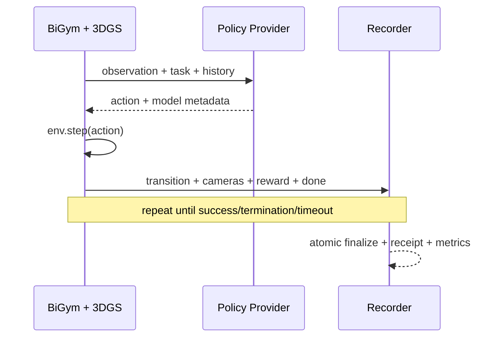

# Closed-loop evaluation

This project uses a provider-neutral external inference interface: BiGym handles environment, observations, action execution, and transition recording; a policy provider returns actions from observations. The main branch does not bind to any specific vendor or OpenPI repo.

## Closed-loop dataflow

## Locked dependencies

| Repo | Source branch | Execution commit | Role |
| --- | --- | --- | --- |
| `eust-w/amd-bigym-3dgs-rocm` | `main` | `f66b9150ca7cfd48746147dfa8326a2657ab309e` | Evaluation orchestration, 3DGS shell, and acceptance rules |
| `WuChao-2024/bigym_plus` | `master` | `d12937686833467b5013ac47a834cf4b6f5a9d53` | Evaluation client and desktop recording baseline |
| `NeuracoreAI/bigym` | `master` | `14beb30318ad14c5d6723175c2ee2281129792af` | Environment and task semantic baseline |
| `nerfstudio-project/gsplat` | `main` | `4d3a3b69db4de0326f983ccf7b7b255271a17b01` | Cross-platform reference rendering baseline |

External policy service repo/branch/commit is not hardcoded in `main`. Every formal evaluation must record provider repo, branch, full commit, model revision, precision, device, and launch parameters in `/health` response and in evaluation receipt. Historical `interence@eb1bdf844a20f02b2fcb419fa1d33ed4db06484f` is only for tracing legacy provider implementation and is not part of current mainline dependencies.

Project closed-loop success is not produced as a single success rate by `main`; each strategy repository/provider generates its own official policy-assessment receipt after using this repo's neutral evaluator and shared protocol. `main` only provides evaluation boundaries, contracts, and channels.

## GPU utilization boundary

| Subprocess | Typical device | Notes |
| --- | --- | --- |
| Multi-camera Gaussian rendering | AMD GPU/ROCm or reference GPU | Multiple projection and rasterization calls may happen per environment step |
| Policy inference | Reported by external provider | May share a card, split across cards, or run remote; client cannot infer from itself |
| MuJoCo physics stepping | Mostly CPU | Do not attribute full-system GPU utilization to physics simulation |
| Encoding, storage, metric aggregation | CPU/media backend mostly | Whether video encoding is GPU depends on encoder configuration |

| Stage | Evidence type | VRAM | GPU utilization | Notes |
| --- | --- | --- | --- | --- |
| Closed-loop evaluator endpoint | Historical measurement, mixed scale | ~`3-8 GiB`, `6%-17%` | ~`20%-80%` | HTTP waits and policy latency can pull down average busy. |
| Simulator + 7B inference on one W7900D | Deployment scenario estimate | ~`19-36 GiB` | Combined ~`50%-100%` | Must pass shared-GPU smoke memory gate first. |

Current `main` does not have continuous co-timed telemetry for rendering GPU and policy GPU, so a reliable end-to-end VRAM/GPU utilization baseline cannot be claimed. Formal evaluation must record client render card and provider inference card separately; these cannot be merged into one percentage. The table above is historical stage-boundary ranges and cannot be treated as a complete single-run production baseline.

## Full evaluation receipt

Each formal trajectory must include at least:

- task, seed, episode ID, start/end time, and termination reason.
- Client repo/branch/commit, BiGym commit, shell revision, Sim(3) config.
- Provider repo/branch/commit, model/revision, device, and precision.
- Per-step observation, policy request, action, reward, done/success.
- Multi-camera video or frame index, frame count, timestamp range, and checksums.
- Render-GPU and inference-GPU utilization/VRAM time-series summary.
- Success rate, valid episode count, and failure classes for timeout/crash/no-request.

## Pass conditions

1. At least one real policy request is made and returns an executable action.
2. Environment completes continuous `observation -> policy -> action -> step` cycle, not only first-frame or health-check response.
3. Trajectory write is atomic and frame count, transition count, and timestamps are internally consistent.
4. A successful task must satisfy task-defined success; `benchmark_complete`, process exit code 0, or `success_rate: 0.0` alone do not prove completion.
5. Formal reports must separate success, failure, no-request, timeout, and infrastructure errors.

## Current conclusion

`main` provides a unified closed-loop evaluation boundary and contract; closed-loop receipts and final success rates are provided by each strategy repository via `model-matrix` / `benchmark` outputs. From these receipts, traces to evaluator API and repo versions in this repository can be followed, but success-rate ownership remains with the corresponding provider repository. `main` should not be described as "not complete" without context.

Each provider repository's success rate in its own `model-matrix` / `benchmark` outputs belongs to that repository, and the base repository cannot claim a final closed-loop success rate independently.

## OpenPI and OpenDM dual-model orchestration

`evaluation/bigym-3dgs/src/run_model_matrix.py` provides a strict dual-model evaluation entry. The example list fixes two external providers: `openpi-jax` and `opendm-dm05`. The orchestrator validates and freezes both `/health` identities, then sequentially executes the same BiGym+3DGS evaluation and produces `model-matrix-summary.json`.

This script contains only HTTP, simulator execution, trajectory recording, checks, and metric comparison. It does not load model weights or include model implementations or checkpoint downloads, and does not include OpenPI/OpenDM inference logic. OpenDM protocol v2 inference adapter was merged upstream via [`Kyrie-w8/amd-bigym-3dgs-opendm#1`](https://github.com/Kyrie-w8/amd-bigym-3dgs-opendm/pull/1). Contribution commit is `394f77f6c321c61e6c3a857728abd651ac09fd13`, and upstream merged into `main` at `8f018b253d0fd2b41a4fa4a87610829eaca74c44`.
