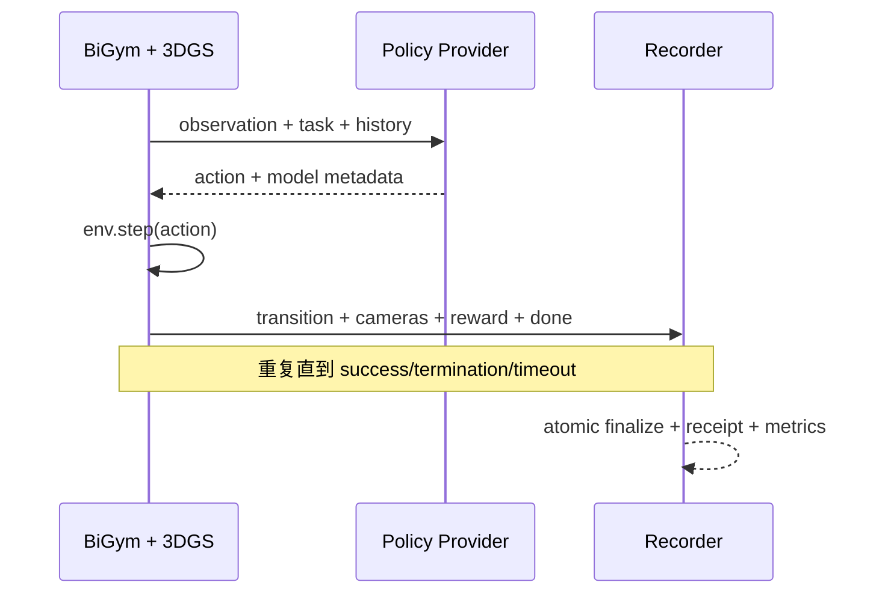

# 闭环评测

本项目采用 provider-neutral 的外部推理接口：BiGym 负责环境、观测、动作执行和轨迹记录；策略服务负责根据观测返回动作。主线不绑定某个供应商或某个 OpenPI 仓库。

## 闭环数据流

## 锁定依赖

| 仓库 | 源分支 | 执行 commit | 作用 |
| --- | --- | --- | --- |
| `eust-w/amd-bigym-3dgs-rocm` | `main` | `f66b9150ca7cfd48746147dfa8326a2657ab309e` | 评测编排、3DGS 壳和验收规则 |
| `WuChao-2024/bigym_plus` | `master` | `d12937686833467b5013ac47a834cf4b6f5a9d53` | 评测客户端和桌面录制基线 |
| `NeuracoreAI/bigym` | `master` | `14beb30318ad14c5d6723175c2ee2281129792af` | 环境与任务语义基线 |
| `nerfstudio-project/gsplat` | `main` | `4d3a3b69db4de0326f983ccf7b7b255271a17b01` | A800 参考渲染基线 |

外部策略服务的 repo/branch/commit 不在 `main` 中硬编码。每次正式评测必须在 `/health` 响应和评测收据中记录服务端仓库、分支、完整 commit、模型权重 revision、精度、设备和启动参数。历史 `interence@eb1bdf844a20f02b2fcb419fa1d33ed4db06484f` 仅用于追溯旧供应商实现，不是当前主线依赖。

本项目的闭环评测成败不是由 `main` 的代码仓库单独“产出成功率”，而是各模型仓库/外部 provider 在使用本仓库提供的中立 evaluator 与统一协议后独立生成对外的策略评估收据；`main` 只提供评测边界、合同与通道。

## GPU 使用边界

| 子过程 | 典型设备 | 说明 |
| --- | --- | --- |
| Gaussian 多相机渲染 | AMD GPU/ROCm 或参考 CUDA GPU | 每个环境步可能触发多次投影与光栅化 |
| 策略推理 | 由外部 provider 报告 | 可能与渲染共卡、分卡或远程执行，不能从客户端推断 |
| MuJoCo 物理步进 | CPU 为主 | 不应把整机 GPU 利用率归因于物理仿真 |
| 编码、写盘、指标汇总 | CPU/媒体后端为主 | 视频编码是否用 GPU 取决于实际编码器配置 |

当前主线没有同一时钟下的渲染 GPU 与策略 GPU 连续遥测，因此不能给出可靠的显存占用率和 GPU 使用率。正式评测必须分别记录客户端渲染卡与 provider 推理卡，不能把二者合并为一个百分比。

## 完整评测收据

每条正式 trajectory 至少包含：

- task、seed、episode ID、开始/结束时间和终止原因。
- 客户端 repo/branch/commit、BiGym commit、壳 revision、Sim(3) 配置。
- provider repo/branch/commit、模型/权重 revision、设备和精度。
- 每步 observation、policy request、action、reward、done/success。
- 各相机视频或逐帧索引、帧数、时间戳范围和校验信息。
- 渲染 GPU 与推理 GPU 的利用率/显存时序摘要。
- 成功率、有效 episode 数、超时/崩溃/无请求等失败分类。

## 通过条件

1. 至少产生一次真实 policy request，并返回可执行动作。
2. 环境完成连续 `observation -> policy -> action -> step` 循环，而不是只生成首帧或健康检查。
3. 轨迹写入原子完成，帧数、transition 数和时间戳相互一致。
4. 成功任务按任务语义达到 success；`benchmark_complete`、进程退出码 0 或 `success_rate: 0.0` 都不能单独证明完成。
5. 正式报告区分成功、失败、无请求、超时和基础设施错误。

## 当前结论

`main` 提供统一闭环评测边界与 contract；闭环评测收据与最终成功率已由各策略仓库
在各自的 `model-matrix` / `benchmark` 结果中给出。按收据可追溯到本仓库的 evaluator 接口与
本仓库版本，但成功率口径归属对应 provider 仓库。主仓库不再以“尚未完成”作为状态表述。

每个 provider 仓库在各自 `model-matrix`/`benchmark` 收据中给出的成功率归属该仓库；
主仓库不得直接声称“已在本仓库得到最终闭环成功率”。

评测摘要状态严格区分：执行、严格壳、真实 policy request 和 schema v2 完整录制均通过但人工三相机审核尚未完成时，状态只能是 `awaiting_visual_approval`；只有人工审核也通过后才允许写为 `evaluation_complete`。schema v1 或缺失 schema 的旧结果不能绕过完整录制门槛。

## OpenPI 与 OpenDM 双模型编排

`evaluation/bigym-3dgs/src/run_model_matrix.py` 提供严格的双模型评测入口。示例清单固定两个外部 provider：`openpi-jax` 与 `opendm-dm05`。编排器先校验并冻结两个 `/health` 身份，再顺序调用同一套 BiGym+3DGS 评测，最终生成 `model-matrix-summary.json`。

该代码只包含 HTTP、模拟器执行、轨迹记录、校验和结果比较，不加载模型、不下载 checkpoint，也不包含 OpenPI/OpenDM 推理实现。OpenDM 的协议 v2 推理 adapter 已通过 [`Kyrie-w8/amd-bigym-3dgs-opendm#1`](https://github.com/Kyrie-w8/amd-bigym-3dgs-opendm/pull/1) 合并上游；贡献 commit 为 `394f77f6c321c61e6c3a857728abd651ac09fd13`，上游 `main` 合并 commit 为 `8f018b253d0fd2b41a4fa4a87610829eaca74c44`。
