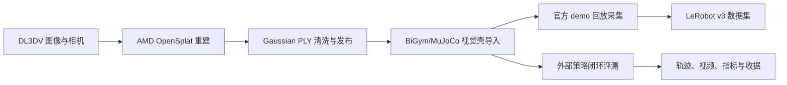

# AMD BiGym 3DGS ROCm 文档中心

本目录是本项目 3D 重建、3DGS 壳导入、BiGym 采集、闭环评测和证据审计的唯一规范文档入口。组件目录中的 README 仅作为就近运行入口；涉及版本、验收状态和跨仓库依赖时，以本目录为准。

## 生命周期总览

## 当前阶段状态

| 阶段 | 当前结论 | 证据边界 |
| --- | --- | --- |
| 3D 重建 | AMD W7900D/ROCm 路径已有可复现的 OpenSplat 运行记录 | 证明重建和产物生成，不自动等于自由视角视觉验收通过 |
| 壳导入 | 已定义 Gaussian 视觉壳、Sim(3) 对齐和零物理碰撞边界 | 视觉壳不是 MuJoCo 物理几何，不能据此声称碰撞或动力学完成 |
| BiGym 采集 | 已有官方 demo 回放、原子 episode 写入和多相机采集设计 | smoke 轨迹不等于正式数据集；失败回放不得计入成功集 |
| 闭环评测 | 已定义 provider-neutral 接口、完整轨迹录制和验收门槛；闭环收据与最终成功率在策略仓库侧 model-matrix/benchmark 输出可追溯 | `main` 在本仓库提供统一 evaluator 与边界定义，不作为策略仓库评估成功率的发布方 |

## 文档索引

| 主题 | 规范文档 |
| --- | --- |
| 端到端架构 | [端到端数据流与系统边界](architecture/end-to-end.md) |
| 3D 重建 | [3D 重建](05-3d-reconstruction.md)、[ROCm 与 gsplat/OpenSplat 说明](02-rocm-gsplat.md) |
| Gaussian 壳导入 | [壳导入](06-shell-import.md)、[端到端对齐说明](01-end-to-end.md) |
| BiGym 采集 | [采集](03-collection.md) |
| 闭环评测 | [评测](07-evaluation.md) |
| 清洗与验证 | [验证和清洗](04-validation-and-cleaning.md) |
| 版本追溯 | [阶段、仓库、分支与 commit 台账](08-repository-revisions.md) |
| 证据边界 | [证据与当前状态](09-evidence-and-status.md) |
| 上游贡献 | [上游 PR](upstream-contributions.md) |
| 图片与视频 | [图片说明](images/README.md)、[视频说明](videos/README.md) |
| 数据许可 | [数据许可](data-license.md) |
| 故障排查 | [故障排查](troubleshooting.md) |

## 版本使用规则

1. 实际执行必须按 [版本台账](08-repository-revisions.md) 中的完整 commit SHA 锁定；仅写 `main` 或 `master` 不具备复现性。
2. 上游贡献分支使用 `upstream/*`，未提交上游的工作分支使用 `work/*`，历史本地分支使用 `archive/*`；项目相关分支不再使用 `agent/*`。
3. 外部推理服务可替换，但每次评测必须在 `/health` 和评测收据中记录 provider、模型、代码版本和服务端配置。
4. 重建、壳导入、采集和评测分别验收。前一阶段通过不能替代后一阶段的运行证据。
