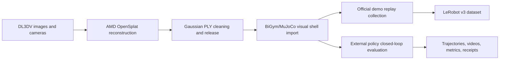

# AMD BiGym 3DGS ROCm Documentation Hub

This directory is the authoritative documentation entry for this project's 3D reconstruction, 3DGS shell import, BiGym collection, closed-loop evaluation, and evidence audits. Component READMEs are only nearby execution entry points; versioning, acceptance state, and cross-repository dependencies follow this hub.

## End-to-end flow

## Current phase status

| Stage | Current conclusion | Evidence boundary |
| --- | --- | --- |
| Reconstruction | AMD W7900D/ROCm path has reproducible OpenSplat run records | Indicates reconstruction and artifact generation, but does not automatically equal free-view visual acceptance. |
| Shell import | Visual shell, Sim(3) alignment, and zero-physics-collision boundaries are defined | A visual shell is not MuJoCo physical geometry; this does not imply collision or dynamics completion. |
| BiGym collection | Official demo replay, atomic episode writes, and multi-camera collection design are in place | Smoke trajectories are not a formal dataset; failed replays must not be counted as success. |
| Closed-loop evaluation | Provider-neutral interface, full trajectory recording, and acceptance gates are defined; closed-loop receipts and final success rates are traceable from each strategy repository's `model-matrix`/`benchmark` outputs | `main` provides a unified evaluator and boundary definitions and does not publish the final strategy-level success rate. |

## Documentation index

| Topic | Canonical document |
| --- | --- |
| End-to-end architecture | [End-to-end dataflow and system boundary](architecture/end-to-end.md) |
| 3D reconstruction | [3D reconstruction](05-3d-reconstruction.md), [ROCm and gsplat/OpenSplat notes](02-rocm-gsplat.md) |
| Gaussian shell import | [Shell import](06-shell-import.md), [End-to-end alignment notes](01-end-to-end.md) |
| BiGym collection | [Collection](03-collection.md) |
| Closed-loop evaluation | [Evaluation](07-evaluation.md) |
| Cleaning and validation | [Validation and cleaning](04-validation-and-cleaning.md) |
| Version traceability | [Phase, repository, branch, and commit ledger](08-repository-revisions.md) |
| Evidence boundaries | [Evidence and current status](09-evidence-and-status.md) |
| Upstream contributions | [Upstream PRs](upstream-contributions.md) |
| Images and videos | [Images guide](images/README.md), [Videos guide](videos/README.md) |
| Data license | [Data and license boundary](data-license.md) |
| Troubleshooting | [Troubleshooting](troubleshooting.md) |

## Version usage policy

1. Actual execution must use full commit SHAs from the [ledger](08-repository-revisions.md); writing only `main` or `master` is not reproducible.
2. Upstream contribution branches use `upstream/*`; unreleased work branches use `work/*`; historical local branches use `archive/*`; project branches no longer use `agent/*`.
3. External policy services are replaceable, but every evaluation must record provider, model, code revision, and service configuration in `/health` and in evaluation receipts.
4. Reconstruction, shell import, collection, and evaluation are accepted separately. Passing one stage does not substitute for the runtime evidence of later stages.
