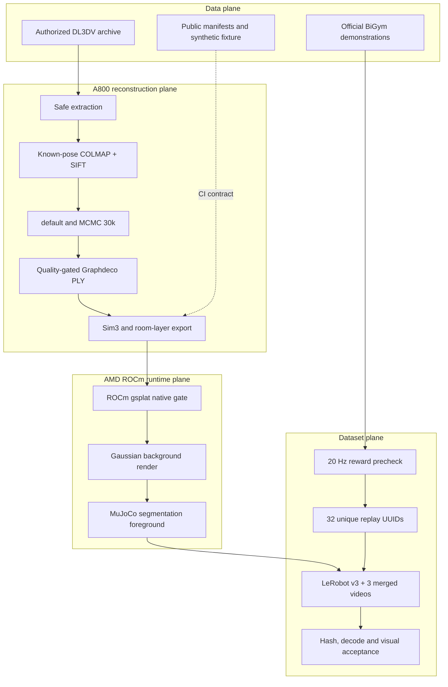

# End-to-end architecture

The planes are deliberately separate. A valid PLY does not prove BiGym
integration; a successful GPU render does not prove dataset reward; and a fully
decoded dataset does not prove photographic quality. Each boundary emits a
machine-readable receipt.
