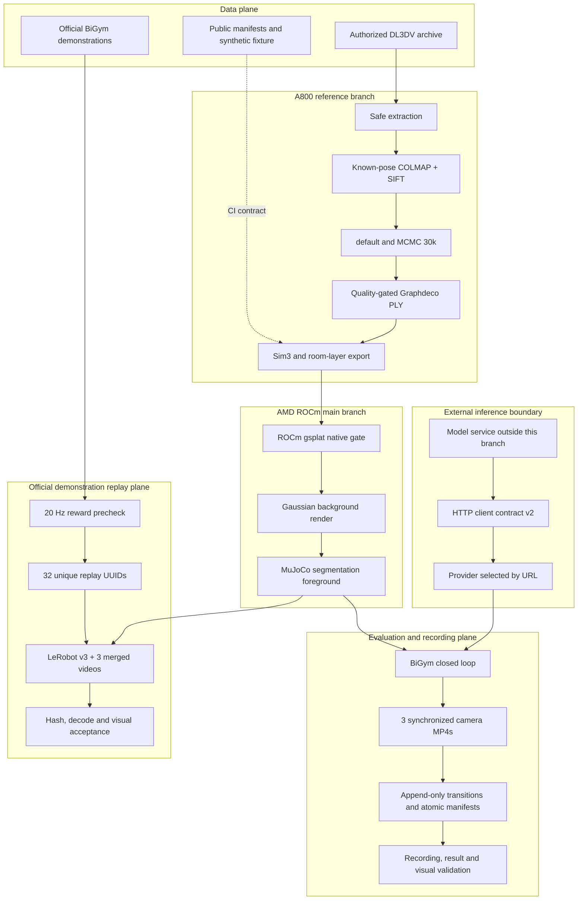

# End-to-end architecture

The code is delivered from one repository, but the runtime planes remain
deliberately separate. A valid PLY does not prove BiGym integration; a healthy
inference endpoint does not prove a complete transition sequence; a complete
recording does not prove task success; and a fully decoded dataset does not
prove photographic quality. Each boundary emits a machine-readable receipt.
